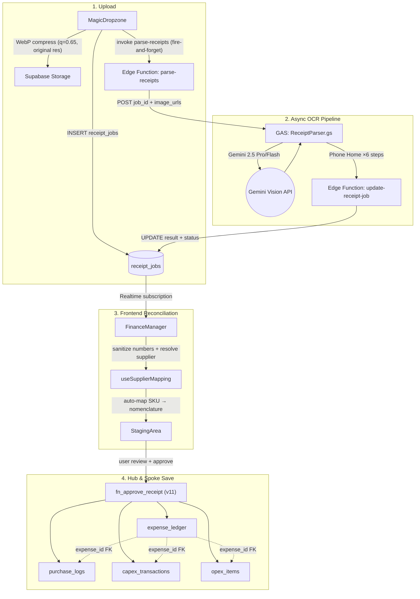
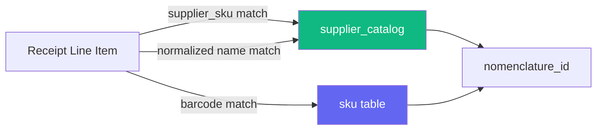

# Receipt Routing Architecture

> [!info] Phases 4.4 → 5.0 → 6.x
> AI-powered receipt parsing with async pipeline. Gemini 2.5 Vision (Pro or Flash, user-selectable) extracts line items and classifies documents. Auto-mapping engine learns supplier SKU → nomenclature patterns. Hub & Spoke routing writes to expense_ledger + 3 spoke tables.

## Pipeline Overview



## Data Flow (Step by Step)

1. User drops receipt images onto **MagicDropzone**
2. Images compressed to **WebP** (quality 0.65, original pixel resolution — preserves OCR readability)
3. Uploaded to Supabase Storage `receipts` bucket → public URLs
4. `receipt_jobs` row created (status: pending, image_urls, model choice)
5. **parse-receipts** Edge Function invoked (fire-and-forget) — zero body read (Supabase bug workaround)
6. Edge Function forwards to **GAS ReceiptParser** with job_id + image_urls
7. GAS calls **Gemini 2.5 Vision** (Pro or Flash) — extracts structured JSON
8. GAS **phones home** 6 times via `update-receipt-job` Edge Function (full observability)
9. Final step writes `result` JSONB + `status: completed` to receipt_jobs
10. **FinanceManager** picks up via Realtime subscription (fallback: 5s poll)
11. **sanitizeNum/sanitizeSigned** cleans OCR artifacts ("225,!" → 225)
12. **useSupplierMapping** auto-maps items: supplier_catalog → SKU → nomenclature_id
13. **StagingArea** shows editable preview — user reviews, maps remaining items, adjusts prices
14. **fn_approve_receipt** atomically writes Hub (expense_ledger) + Spokes (purchase_logs, capex_transactions, opex_items)

## AI Model Selection

| Model | Use Case | Speed | Accuracy |
|-------|----------|-------|----------|
| `gemini-2.5-pro` | Complex receipts, long item lists, poor quality photos | Slower (~30-60s) | Higher |
| `gemini-2.5-flash` | Simple receipts, clear photos, few items | Fast (~10-20s) | Good |

User selects model in MagicDropzone UI → stored in `localStorage` → passed as query param to Edge Function → forwarded to GAS.

## Anti-Hallucination Defenses (Phase 6.2)

| Defense | Where | How |
|---------|-------|-----|
| Item count anchor | GAS prompt | "item_count_observed: N" — AI must match physical count |
| Confidence scoring | GAS prompt | Each item gets confidence: high/medium/low |
| Price math check | GAS post-process | unit_price × quantity ≈ total_price (±5%) |
| Duplicate detection | GAS post-process | Flags identical items with same price |
| UNREADABLE rule | GAS prompt | Illegible items marked as UNREADABLE, not guessed |
| Confidence colors | Frontend | Green (high), amber (medium), red (low) borders |

## Document Classification

Gemini classifies which uploaded image is what:
```json
{
  "documents": {
    "supplier_receipt_index": 0,
    "bank_slip_index": 1,
    "tax_invoice_index": 2
  }
}
```
Maps to `receipt_supplier_url`, `receipt_bank_url`, `tax_invoice_url` in expense_ledger.

## Auto-Mapping Engine (Phase 6.4)



- **Priority**: SKU match > name match > barcode fallback
- **Self-learning**: Manual mappings saved to `supplier_catalog` on Approve (with `match_count++`)
- **UoM conversion**: Tracks `purchase_unit` → `base_unit` × `conversion_factor`

## Data Sanitization (Phase 6.6)

| Function | Input | Output |
|----------|-------|--------|
| `sanitizeNum("225,!")` | OCR garbage | `225` |
| `sanitizeNum("1.0.00")` | Multiple dots | `1` |
| `sanitizeSigned("-15,50")` | Negative with comma | `-15.5` |

Applied to all numeric fields: line items (qty, unit_price, total_price) + footer (subtotal, discount, VAT, delivery, grand_total).

## HMR Resilience (Phase 5.0f)

Google Drive file sync triggers Vite HMR reloads during long OCR jobs. Three-layer defense:

1. **Module-level resolver** — function outside React lifecycle, idempotent
2. **sessionStorage** — persists `pendingJobId`, `imageUrls`, `stagingData` across reloads
3. **Custom event bridge** — `receipt-job-resolved` event + fallback poll every 5s

## StagingArea Features (Phase 6.x)

| Feature | Phase | Description |
|---------|-------|-------------|
| Searchable nomenclature dropdown | 6.6 | Zero-dep combobox replacing native `<select>` for 500+ items |
| Net weight display | 6.6 | Σ qty × package_weight with auto-normalization (1500g → 1.5 kg) |
| Cat / Sub columns | 6.6 | Separate Category (L2) + Subcategory (L3) from product_categories |
| Sticky headers + total bar | 6.6 | Table scrolls, headers and totals stay visible |
| Confidence colors | 6.2 | Green/amber/red borders based on AI confidence |
| ReconciliationPanel | 6.1 | Editable footer (discount, VAT, delivery), green checkmark when balanced |
| Unlink button | 6.4 | Remove incorrect auto-mapping with ✕ |

## Classification Rules

| Category | Target Table | Examples |
|----------|-------------|---------|
| Food items | `purchase_logs` | Produce, proteins, grains, dairy, spices, oils |
| CapEx items | `capex_transactions` | Equipment, machinery, furniture, IT hardware |
| OpEx items | `opex_items` | Cleaning supplies, packaging, disposables, services |

## Key Files

| File | Purpose |
|------|---------|
| `components/finance/MagicDropzone.tsx` | Upload + WebP compress + model select + fire-and-forget |
| `pages/FinanceManager.tsx` | Job orchestration, Realtime, sanitization, reclassification |
| `components/finance/StagingArea.tsx` | Editable preview, mapping UI, approve flow |
| `hooks/useSupplierMapping.ts` | Auto-mapping engine (SKU + name + barcode) |
| `components/finance/SearchableNomenclatureSelect.tsx` | Searchable combobox for nomenclature mapping |
| `components/finance/helpers.ts` | formatTHB, parseWeight, formatNetWeight |
| `supabase/functions/parse-receipts/index.ts` | Zero-body proxy Edge Function |
| `gas/ReceiptParser.gs` | Gemini Vision OCR + Phone Home pipeline |
| `supabase/functions/update-receipt-job/index.ts` | Callback endpoint for GAS |

## Future Roadmap

| Input Type | Status | Notes |
|------------|--------|-------|
| **Photo receipt (printed)** | ✅ Done | Gemini Vision, async pipeline |
| **PDF nomenclature** | 🔜 Planned | Gemini PDF parsing → structured data |
| **Handwritten receipt (Thai)** | 🔜 Planned | Gemini Vision + Thai-specific prompt |
| **Free text NLP** | 🔜 Planned | "заплатили Richi за газ в Л1" → expense_ledger |

All input types converge to the same staging pipeline (StagingArea). Difference is only in frontend input widget + AI parsing prompt.

## Related

- [[Database Schema]] — Full schema with ERD
- [[Financial Ledger]] — Finance module architecture
- [[Procurement & Receiving Architecture]] — PO-based receiving flow
- [[Product Categorization Architecture]] — Category hierarchy (product_categories vs fin_categories)
