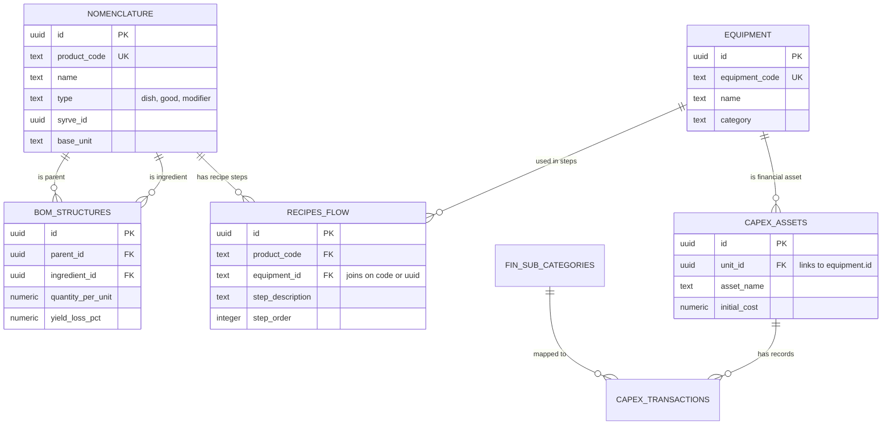

# CURRENT LIVE DATABASE SCHEMA (Supabase Mirror)

This blueprint documents the active relationships in the `public` schema. It serves as the single source of truth for all Data Sync agents.

## 🗺️ Entity Relationship Diagram (ERD)

## 🛠️ Data Sync Logic
1. **Mesh Construction**: Notes are generated by querying `nomenclature` + `bom_structures`.
2. **Bi-directional Linking**:
   - `## Components` -> `bom_structures.ingredient_id`
   - `## Used In` -> `bom_structures.parent_id`
3. **P0 Integrity**: All links rely on `product_code` or `UUID`. Legacy table dependencies have been eliminated.
