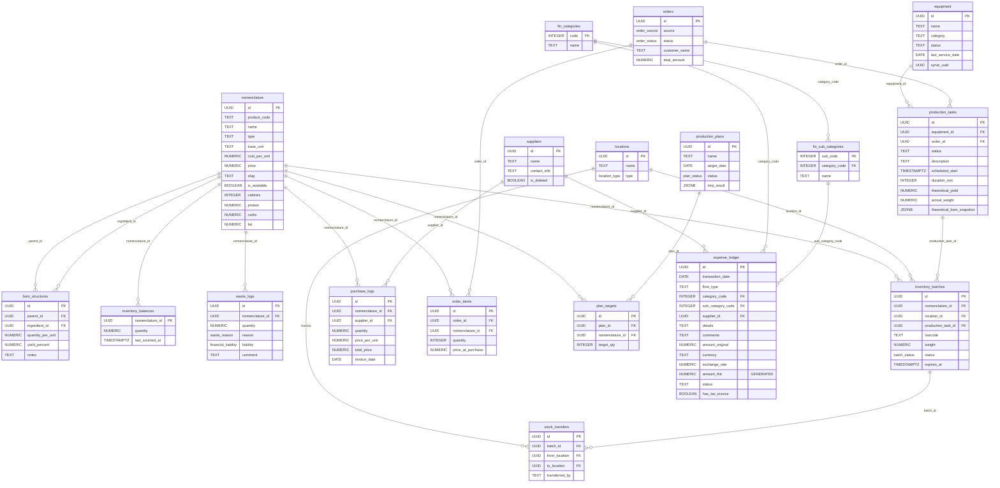

# Database Schema

> [!info] Single Source of Truth
> Supabase PostgreSQL 17.6 (`qcqgtcsjoacuktcewpvo`, ap-south-1). This note documents every table, FK, RPC, and trigger deployed to production.

## Entity Relationship Diagram

## Tables Index

| Table | PK | Key Columns | Foreign Keys | Migration |
|---|---|---|---|---|
| `nomenclature` | `id` UUID | product_code, name, type, base_unit, cost_per_unit, price, slug | -- | 005, 019, 020 |
| `bom_structures` | `id` UUID | parent_id, ingredient_id, quantity_per_unit | parent_id -> nomenclature, ingredient_id -> nomenclature | 007, 012 |
| `equipment` | `id` UUID | name, category, status, last_service_date | -- | pre-existing |
| `production_tasks` | `id` UUID | status, scheduled_start, equipment_id, order_id | equipment_id -> equipment, order_id -> orders | 016, 022 |
| `recipes_flow` | `id` UUID | -- | -- | pre-existing |
| `daily_plan` | `id` UUID | -- | -- | pre-existing |
| `fin_categories` | `code` INT | name | -- | 003 |
| `fin_sub_categories` | `sub_code` INT | category_code, name | category_code -> fin_categories | 003 |
| `capex_assets` | `id` UUID | equipment FK | equipment_id -> equipment | 003 |
| `capex_transactions` | `id` UUID | category_code, amount_thb | category_code -> fin_categories | 003 |
| `inventory_balances` | `nomenclature_id` UUID | quantity, last_counted_at | nomenclature_id -> nomenclature | 017 |
| `waste_logs` | `id` UUID | nomenclature_id, quantity, reason | nomenclature_id -> nomenclature | 017 |
| `locations` | `id` UUID | name (UNIQUE), type | -- | 018 |
| `inventory_batches` | `id` UUID | barcode (UNIQUE), status, expires_at | nomenclature_id -> nomenclature, location_id -> locations, production_task_id -> production_tasks | 018 |
| `stock_transfers` | `id` UUID | from_location, to_location | batch_id -> inventory_batches, from/to -> locations | 018 |
| `suppliers` | `id` UUID | name (UNIQUE), is_deleted | -- | 021, 025 |
| `purchase_logs` | `id` UUID | quantity, price_per_unit, invoice_date | nomenclature_id -> nomenclature, supplier_id -> suppliers | 021 |
| `orders` | `id` UUID | source, status, customer_name, total_amount | -- | 022 |
| `order_items` | `id` UUID | quantity, price_at_purchase | order_id -> orders (CASCADE), nomenclature_id -> nomenclature | 022 |
| `production_plans` | `id` UUID | name, target_date, status, mrp_result | -- | 023 |
| `plan_targets` | `id` UUID | target_qty, UNIQUE(plan_id,nomenclature_id) | plan_id -> production_plans (CASCADE), nomenclature_id -> nomenclature | 023 |
| `expense_ledger` | `id` UUID | details, comments, amount_original, currency, exchange_rate, amount_thb (GENERATED), has_tax_invoice | category_code -> fin_categories, sub_category_code -> fin_sub_categories, supplier_id -> suppliers | 024, 026 |

## Custom ENUM Types

| Enum | Values | Used In |
|---|---|---|
| `waste_reason` | expiration, spillage_damage, quality_reject, rd_testing | waste_logs.reason |
| `financial_liability` | cafe, employee, supplier | waste_logs.liability |
| `location_type` | kitchen, assembly, storage, delivery | locations.type |
| `batch_status` | sealed, opened, depleted, wasted | inventory_batches.status |
| `order_source` | website, syrve, manual | orders.source |
| `order_status` | new, preparing, ready, delivered, cancelled | orders.status |
| `plan_status` | draft, active, completed | production_plans.status |

## RPCs & Triggers

| Function | Type | Purpose | Migration |
|---|---|---|---|
| `fn_start_production_task(UUID)` | RPC | Start cook task, freeze BOM snapshot | 016 |
| `fn_predictive_procurement(UUID)` | RPC | Recursive BOM walk, shortage calc | 017 |
| `fn_generate_barcode()` | UTIL | 8-char alphanumeric barcode | 018 |
| `fn_create_batches_from_task(UUID, JSONB)` | RPC | Create batches + complete task | 018 |
| `fn_open_batch(UUID)` | RPC | Open batch, shrink expires_at +12h | 018 |
| `fn_transfer_batch(TEXT, TEXT)` | RPC | Move batch by barcode, log transfer | 018 |
| `fn_update_cost_on_purchase()` | TRIGGER FN | Auto-update nomenclature.cost_per_unit on purchase | 021 |
| `fn_process_new_order(UUID)` | RPC | BOM explosion: order items -> production tasks | 022 |
| `fn_run_mrp(UUID)` | RPC | 2-level MRP engine: SALE->PF/MOD->RAW, inventory deduction | 023 |
| `fn_approve_plan(UUID)` | RPC | Convert prep_schedule to production_tasks | 023 |
| `fn_set_updated_at()` | TRIGGER FN | Generic updated_at setter | 021 |
| `sync_equipment_last_service()` | TRIGGER FN | Auto-update equipment.last_service_date | pre-existing |

## Storage Buckets

| Bucket | Public | Max Size | MIME Types | Purpose |
|---|---|---|---|---|
| `receipts` | Yes (read) | 5 MB | JPEG, PNG, WebP, PDF | Expense receipt storage (supplier/, bank/, tax/) |

## Related

- [[Shishka OS Architecture]] -- System overview and module map
- [[Financial Ledger]] -- Finance module details
- [[STATE]] -- Migration deployment history
