# Database Schema

> [!info] Single Source of Truth
> Supabase PostgreSQL 17.6 (`qcqgtcsjoacuktcewpvo`, ap-south-1). This note documents every table, FK, RPC, and trigger deployed to production.

## Entity Relationship Diagram

```mermaid
erDiagram
    nomenclature {
        UUID id PK
        TEXT product_code
        TEXT name
        TEXT type
        TEXT base_unit
        NUMERIC cost_per_unit
        NUMERIC price
        TEXT slug
        BOOLEAN is_available
        INTEGER calories
        NUMERIC protein
        NUMERIC carbs
        NUMERIC fat
        UUID category_id FK
    }

    product_categories {
        UUID id PK
        TEXT code "UNIQUE"
        TEXT name
        TEXT name_th
        UUID parent_id FK
        SMALLINT level "1-3"
        INTEGER sort_order
        INTEGER default_fin_sub_code FK
        BOOLEAN is_active
    }

    brands {
        UUID id PK
        TEXT name "UNIQUE"
        TEXT name_th
        TEXT country
        BOOLEAN is_active
    }

    tags {
        UUID id PK
        TEXT slug "UNIQUE"
        TEXT name
        TEXT name_th
        tag_group tag_group
        TEXT color
        INTEGER sort_order
    }

    nomenclature_tags {
        UUID nomenclature_id FK
        UUID tag_id FK
    }

    bom_structures {
        UUID id PK
        UUID parent_id FK
        UUID ingredient_id FK
        NUMERIC quantity_per_unit
        NUMERIC yield_percent
        TEXT notes
    }

    equipment {
        UUID id PK
        TEXT name
        TEXT category
        TEXT status
        DATE last_service_date
        UUID syrve_uuid
    }

    production_tasks {
        UUID id PK
        UUID equipment_id FK
        UUID order_id FK
        UUID target_nomenclature_id FK "Phase 7.1"
        NUMERIC target_quantity "Phase 7.1"
        TEXT status
        TEXT description
        TIMESTAMPTZ scheduled_start
        INTEGER duration_min
        NUMERIC theoretical_yield
        NUMERIC actual_weight
        JSONB theoretical_bom_snapshot
    }

    production_task_outputs {
        UUID id PK
        UUID task_id FK
        UUID nomenclature_id FK
        NUMERIC planned_quantity
        NUMERIC actual_quantity
        BOOLEAN is_primary
    }

    sku {
        UUID id PK
        TEXT sku_code "UNIQUE SKU-0001"
        UUID nomenclature_id FK
        TEXT barcode "UNIQUE WHERE NOT NULL"
        TEXT product_name
        TEXT product_name_th
        TEXT full_title
        UUID brand_id FK
        TEXT brand
        TEXT package_weight
        NUMERIC package_qty
        TEXT package_unit
        TEXT package_type
        BOOLEAN is_active
    }

    sku_balances {
        UUID sku_id PK
        UUID nomenclature_id FK
        NUMERIC quantity
        TIMESTAMPTZ last_counted_at
        TIMESTAMPTZ last_received_at
    }

    waste_logs {
        UUID id PK
        UUID nomenclature_id FK
        NUMERIC quantity
        waste_reason reason
        financial_liability liability
        TEXT comment
    }

    locations {
        UUID id PK
        TEXT name
        location_type type
    }

    inventory_batches {
        UUID id PK
        UUID nomenclature_id FK
        UUID location_id FK
        UUID production_task_id FK
        TEXT barcode
        NUMERIC weight
        batch_status status
        TIMESTAMPTZ expires_at
    }

    stock_transfers {
        UUID id PK
        UUID batch_id FK
        UUID from_location FK
        UUID to_location FK
        TEXT transferred_by
    }

    suppliers {
        UUID id PK
        TEXT name
        TEXT contact_info
        BOOLEAN is_deleted
        INTEGER category_code FK
        INTEGER sub_category_code
    }

    purchase_logs {
        UUID id PK
        UUID nomenclature_id FK
        UUID supplier_id FK
        UUID expense_id FK
        UUID sku_id FK "Phase 10"
        NUMERIC quantity
        NUMERIC price_per_unit
        NUMERIC total_price
        DATE invoice_date
    }

    fin_categories {
        INTEGER code PK
        TEXT name
        TEXT type "Asset or Expense"
    }

    fin_sub_categories {
        INTEGER sub_code PK
        INTEGER category_code FK
        TEXT name
    }

    orders {
        UUID id PK
        order_source source
        order_status status
        TEXT customer_name
        NUMERIC total_amount
    }

    order_items {
        UUID id PK
        UUID order_id FK
        UUID nomenclature_id FK
        UUID parent_item_id FK "Self-ref Phase 7.1"
        TEXT modifier_type "topping modifier extra removal side"
        INTEGER quantity
        NUMERIC price_at_purchase
    }

    production_plans {
        UUID id PK
        TEXT name
        DATE target_date
        plan_status status
        JSONB mrp_result
    }

    plan_targets {
        UUID id PK
        UUID plan_id FK
        UUID nomenclature_id FK
        INTEGER target_qty
    }

    expense_ledger {
        UUID id PK
        DATE transaction_date
        TEXT flow_type
        INTEGER category_code FK
        INTEGER sub_category_code FK
        UUID supplier_id FK
        UUID created_by "Phase 7.1"
        TEXT details
        TEXT comments
        TEXT invoice_number
        NUMERIC amount_original
        TEXT currency
        NUMERIC exchange_rate
        NUMERIC amount_thb "GENERATED"
        NUMERIC discount_total
        NUMERIC vat_amount
        NUMERIC delivery_fee
        TEXT status
        BOOLEAN has_tax_invoice
    }

    capex_transactions {
        UUID id PK
        TEXT transaction_id "UNIQUE"
        UUID asset_id FK
        UUID expense_id FK
        NUMERIC amount_thb
        DATE transaction_date
        TEXT transaction_type
        INTEGER category_code FK
        TEXT vendor
        TEXT details
    }

    opex_items {
        UUID id PK
        UUID expense_id FK
        TEXT description
        NUMERIC quantity
        TEXT unit
        NUMERIC unit_price
        NUMERIC total_price
    }

    supplier_catalog {
        UUID id PK
        UUID supplier_id FK
        UUID nomenclature_id FK
        UUID sku_id FK "Phase 10"
        TEXT supplier_sku
        TEXT original_name
        INT match_count
        TEXT purchase_unit
        NUMERIC conversion_factor
        TEXT base_unit
        TEXT barcode
        TEXT product_name
        TEXT product_name_th
        TEXT brand
        UUID brand_id FK
        TEXT full_title
        TEXT package_weight
        NUMERIC package_qty
        TEXT package_unit
        TEXT package_type
        INTEGER category_code FK
        INTEGER sub_category_code FK
        NUMERIC last_seen_price
        TEXT source
        TIMESTAMPTZ verified_at
    }

    receipt_jobs {
        UUID id PK
        TEXT status "pending processing completed failed"
        JSONB image_urls
        JSONB result "ParsedReceipt JSON"
        TEXT error
        TEXT ocr_text "Raw GCV OCR text for debugging"
        TIMESTAMPTZ created_at
        TIMESTAMPTZ completed_at
        INTEGER duration_ms
        TEXT model "gcv+gpt-4o-mini"
    }

    purchase_orders {
        UUID id PK
        TEXT po_number "UNIQUE PO-0001"
        UUID supplier_id FK
        po_status status
        DATE expected_date
        TEXT notes
        NUMERIC subtotal
        NUMERIC grand_total
        UUID source_plan_id FK
        UUID expense_id FK
        UUID created_by
    }

    po_lines {
        UUID id PK
        UUID po_id FK
        UUID nomenclature_id FK
        UUID sku_id FK
        NUMERIC qty_ordered
        TEXT unit
        NUMERIC unit_price_expected
        NUMERIC total_expected "GENERATED"
        SMALLINT sort_order
    }

    receiving_records {
        UUID id PK
        UUID po_id FK
        UUID expense_id FK
        receiving_source source
        UUID received_by
        TIMESTAMPTZ received_at
        TEXT status
    }

    receiving_lines {
        UUID id PK
        UUID receiving_id FK
        UUID po_line_id FK
        UUID nomenclature_id FK
        UUID sku_id FK
        NUMERIC qty_expected
        NUMERIC qty_received
        NUMERIC qty_rejected
        reject_reason reject_reason
        NUMERIC unit_price_actual
    }

    nomenclature ||--o{ bom_structures : "parent_id"
    nomenclature ||--o{ bom_structures : "ingredient_id"
    nomenclature ||--o{ sku : "nomenclature_id"
    nomenclature ||--o{ sku_balances : "nomenclature_id"
    nomenclature ||--o{ waste_logs : "nomenclature_id"
    nomenclature ||--o{ inventory_batches : "nomenclature_id"
    nomenclature ||--o{ purchase_logs : "nomenclature_id"
    nomenclature ||--o{ order_items : "nomenclature_id"
    nomenclature ||--o{ plan_targets : "nomenclature_id"
    nomenclature ||--o{ nomenclature_tags : "nomenclature_id"
    nomenclature ||--o{ production_tasks : "target_nomenclature_id"
    nomenclature ||--o{ production_task_outputs : "nomenclature_id"

    sku ||--o| sku_balances : "sku_id"
    sku ||--o{ supplier_catalog : "sku_id"
    sku ||--o{ purchase_logs : "sku_id"

    product_categories ||--o{ nomenclature : "category_id"
    product_categories ||--o{ product_categories : "parent_id"
    brands ||--o{ sku : "brand_id"
    brands ||--o{ supplier_catalog : "brand_id"
    tags ||--o{ nomenclature_tags : "tag_id"
    fin_sub_categories ||--o{ product_categories : "default_fin_sub_code"

    equipment ||--o{ production_tasks : "equipment_id"
    orders ||--o{ order_items : "order_id"
    order_items ||--o{ order_items : "parent_item_id"
    orders ||--o{ production_tasks : "order_id"
    production_tasks ||--o{ production_task_outputs : "task_id"

    locations ||--o{ inventory_batches : "location_id"
    locations ||--o{ stock_transfers : "from/to"
    inventory_batches ||--o{ stock_transfers : "batch_id"
    production_tasks ||--o{ inventory_batches : "production_task_id"

    suppliers ||--o{ purchase_logs : "supplier_id"
    suppliers ||--o{ expense_ledger : "supplier_id"
    fin_categories ||--o{ suppliers : "category_code"

    fin_categories ||--o{ fin_sub_categories : "category_code"
    fin_categories ||--o{ expense_ledger : "category_code"
    fin_sub_categories ||--o{ expense_ledger : "sub_category_code"

    production_plans ||--o{ plan_targets : "plan_id"

    expense_ledger ||--o{ purchase_logs : "expense_id"
    expense_ledger ||--o{ capex_transactions : "expense_id"
    expense_ledger ||--o{ opex_items : "expense_id"

    suppliers ||--o{ supplier_catalog : "supplier_id"
    nomenclature ||--o{ supplier_catalog : "nomenclature_id"
    fin_categories ||--o{ supplier_catalog : "category_code"
    fin_sub_categories ||--o{ supplier_catalog : "sub_category_code"

    suppliers ||--o{ purchase_orders : "supplier_id"
    purchase_orders ||--o{ po_lines : "po_id"
    purchase_orders ||--o{ receiving_records : "po_id"
    nomenclature ||--o{ po_lines : "nomenclature_id"
    sku ||--o{ po_lines : "sku_id"
    receiving_records ||--o{ receiving_lines : "receiving_id"
    po_lines ||--o{ receiving_lines : "po_line_id"
    nomenclature ||--o{ receiving_lines : "nomenclature_id"
    production_plans ||--o{ purchase_orders : "source_plan_id"
    expense_ledger ||--o{ purchase_orders : "expense_id"
```

## Tables Index

| Table | PK | Key Columns | Foreign Keys | Migration |
|---|---|---|---|---|
| `nomenclature` | `id` UUID | product_code, name, type, base_unit, cost_per_unit, price, slug, category_id | category_id -> product_categories | 005, 019, 020, 046, 059 |
| `bom_structures` | `id` UUID | parent_id, ingredient_id, quantity_per_unit | parent_id -> nomenclature, ingredient_id -> nomenclature | 007, 012 |
| `equipment` | `id` UUID | name, category, status, last_service_date | -- | pre-existing |
| `production_tasks` | `id` UUID | status, scheduled_start, equipment_id, order_id, target_nomenclature_id, target_quantity | equipment_id -> equipment, order_id -> orders, target_nomenclature_id -> nomenclature | 016, 022, 048 |
| `production_task_outputs` | `id` UUID | task_id, nomenclature_id, planned_quantity, actual_quantity, is_primary, UNIQUE(task_id,nomenclature_id) | task_id -> production_tasks (CASCADE), nomenclature_id -> nomenclature | 048 |
| ~~`recipes_flow`~~ | -- | DROPPED (056) | -- | pre-existing → 056 |
| ~~`daily_plan`~~ | -- | DROPPED (056) | -- | pre-existing → 056 |
| `fin_categories` | `code` INT | name | -- | 003 |
| `fin_sub_categories` | `sub_code` INT | category_code, name | category_code -> fin_categories | 003 |
| `capex_assets` | `id` UUID | equipment FK | equipment_id -> equipment | 003 |
| `capex_transactions` | `id` UUID | transaction_id (UNIQUE), category_code, amount_thb, expense_id | category_code -> fin_categories, expense_id -> expense_ledger | 003, 030 |
| `sku` | `id` UUID | sku_code (UNIQUE), nomenclature_id, barcode (UNIQUE WHERE NOT NULL), product_name, product_name_th, brand_id, brand, package_weight, package_qty, package_unit, package_type, is_active | nomenclature_id -> nomenclature (CASCADE), brand_id -> brands | 057 |
| `sku_balances` | `sku_id` UUID | nomenclature_id, quantity, last_counted_at, last_received_at | sku_id -> sku (CASCADE), nomenclature_id -> nomenclature | 057 |
| ~~`inventory_balances`~~ | -- | DROPPED (058). Replaced by sku_balances + v_inventory_by_nomenclature | -- | 017 → 058 |
| `waste_logs` | `id` UUID | nomenclature_id, quantity, reason | nomenclature_id -> nomenclature | 017 |
| `locations` | `id` UUID | name (UNIQUE), type | -- | 018 |
| `inventory_batches` | `id` UUID | barcode (UNIQUE), status, expires_at | nomenclature_id -> nomenclature, location_id -> locations, production_task_id -> production_tasks | 018 |
| `stock_transfers` | `id` UUID | from_location, to_location | batch_id -> inventory_batches, from/to -> locations | 018 |
| `suppliers` | `id` UUID | name (UNIQUE), is_deleted, category_code, sub_category_code | category_code -> fin_categories | 021, 025, 032 |
| `purchase_logs` | `id` UUID | quantity, price_per_unit, invoice_date, expense_id, sku_id | nomenclature_id -> nomenclature, supplier_id -> suppliers, expense_id -> expense_ledger, sku_id -> sku | 021, 030, 057 |
| `orders` | `id` UUID | source, status, customer_name, total_amount | -- | 022 |
| `order_items` | `id` UUID | quantity, price_at_purchase, parent_item_id, modifier_type | order_id -> orders (CASCADE), nomenclature_id -> nomenclature, parent_item_id -> order_items (self-ref CASCADE) | 022, 051 |
| `production_plans` | `id` UUID | name, target_date, status, mrp_result | -- | 023 |
| `plan_targets` | `id` UUID | target_qty, UNIQUE(plan_id,nomenclature_id) | plan_id -> production_plans (CASCADE), nomenclature_id -> nomenclature | 023 |
| `expense_ledger` | `id` UUID | details, comments, invoice_number, amount_original, currency, exchange_rate, amount_thb (GENERATED), has_tax_invoice, discount_total, vat_amount, delivery_fee, created_by | category_code -> fin_categories, sub_category_code -> fin_sub_categories, supplier_id -> suppliers | 024, 026, 030, 038, 041, 052 |
| `opex_items` | `id` UUID | description, quantity, unit, unit_price, total_price | expense_id -> expense_ledger (CASCADE) | 030 |
| `supplier_catalog` | `id` UUID | supplier_sku, original_name, match_count, purchase_unit, conversion_factor, base_unit, barcode, product_name, product_name_th, brand, full_title, package_qty, package_unit, package_type, last_seen_price, source, brand_id, sku_id | supplier_id -> suppliers (CASCADE), nomenclature_id -> nomenclature (CASCADE), category_code -> fin_categories, sub_category_code -> fin_sub_categories, brand_id -> brands, sku_id -> sku | 049, 057 |
| ~~`supplier_item_mapping`~~ | VIEW | DROPPED (056). Was backward-compat view over supplier_catalog | -- | 049 → 056 |
| ~~`supplier_products`~~ | VIEW | DROPPED (056). Was backward-compat view over supplier_catalog | -- | 049 → 056 |
| `receipt_jobs` | `id` UUID | status, image_urls (JSONB), result (JSONB), error, ocr_text, duration_ms, model | -- (standalone, pre-approval) | 036, 037 |
| `product_categories` | `id` UUID | code (UNIQUE), name, name_th, level (1-3), sort_order, is_active, default_fin_sub_code | parent_id -> product_categories (self-ref), default_fin_sub_code -> fin_sub_categories | 045 |
| `brands` | `id` UUID | name (UNIQUE), name_th, country, is_active | -- | 045 |
| `tags` | `id` UUID | slug (UNIQUE), name, name_th, tag_group (ENUM), color, sort_order | -- | 045 |
| `nomenclature_tags` | `(nomenclature_id, tag_id)` composite | -- | nomenclature_id -> nomenclature (CASCADE), tag_id -> tags (CASCADE) | 045 |
| `purchase_orders` | `id` UUID | po_number (UNIQUE), status (po_status), expected_date, subtotal, discount_total, vat_amount, delivery_fee, grand_total, created_by | supplier_id -> suppliers, source_plan_id -> production_plans, expense_id -> expense_ledger | 061 |
| `po_lines` | `id` UUID | qty_ordered, unit, unit_price_expected, total_expected (GENERATED), sort_order, UNIQUE(po_id, nomenclature_id, sku_id) | po_id -> purchase_orders (CASCADE), nomenclature_id -> nomenclature, sku_id -> sku | 061 |
| `receiving_records` | `id` UUID | source (receiving_source), received_by, received_at, status ('received'/'reconciled') | po_id -> purchase_orders, expense_id -> expense_ledger | 062 |
| `receiving_lines` | `id` UUID | qty_expected, qty_received, qty_rejected, reject_reason (reject_reason), unit_price_actual | receiving_id -> receiving_records (CASCADE), po_line_id -> po_lines, nomenclature_id -> nomenclature, sku_id -> sku | 062 |

## Custom ENUM Types

| Enum | Values | Used In |
|---|---|---|
| `waste_reason` | expiration, spillage_damage, quality_reject, rd_testing | waste_logs.reason |
| `financial_liability` | cafe, employee, supplier | waste_logs.liability |
| `location_type` | kitchen, assembly, storage, delivery | locations.type |
| `batch_status` | sealed, opened, depleted, wasted | inventory_batches.status |
| `order_source` | website, syrve, manual | orders.source |
| `order_status` | new, preparing, ready, delivered, cancelled | orders.status |
| `plan_status` | draft, active, completed | production_plans.status |
| `tag_group` | dietary, allergen, functional, storage, quality, cuisine, technique | tags.tag_group |
| `po_status` | draft, submitted, confirmed, shipped, partially_received, received, reconciled, cancelled | purchase_orders.status |
| `receiving_source` | purchase_order, receipt | receiving_records.source |
| `reject_reason` | short_delivery, damaged, wrong_item, quality_reject, expired | receiving_lines.reject_reason |

## RPCs & Triggers

| Function | Type | Purpose | Migration |
|---|---|---|---|
| `fn_start_production_task(UUID)` | RPC | Start cook task, freeze BOM snapshot. Reads target_nomenclature_id directly (056 rewrite, was flow_step_id→recipes_flow) | 016, 056 |
| `fn_predictive_procurement(UUID)` | RPC | Procurement v3: reads stock from v_inventory_by_nomenclature (was inventory_balances) | 017, 056, 058 |
| `fn_generate_barcode()` | UTIL | 8-char alphanumeric barcode | 018 |
| `fn_create_batches_from_task(UUID, JSONB)` | RPC | Create batches + complete task. Reads target_nomenclature_id directly (056 rewrite) | 018, 056 |
| `fn_open_batch(UUID)` | RPC | Open batch, shrink expires_at +12h | 018 |
| `fn_transfer_batch(TEXT, TEXT)` | RPC | Move batch by barcode, log transfer | 018 |
| `fn_update_cost_on_purchase()` | TRIGGER FN | WAC v3: reads from v_inventory_by_nomenclature (was inventory_balances) | 021, 050, 058 |
| `fn_process_new_order(UUID)` | RPC | BOM explosion: order items -> production tasks | 022 |
| `fn_run_mrp(UUID)` | RPC | MRP v2: reads stock from v_inventory_by_nomenclature (was inventory_balances) | 023, 058 |
| `fn_approve_plan(UUID)` | RPC | Convert prep_schedule to production_tasks | 023 |
| `fn_set_updated_at()` | TRIGGER FN | Generic updated_at setter | 021 |
| `fn_approve_receipt(JSONB)` | RPC | Receipt approval v11: SKU resolution + sku_balances UPSERT + receiving_records audit trail | 030, 038, 040, 041, 047, 049, 058, 065 |
| `fn_generate_sku_code()` | UTIL FN | Generates next SKU code: SKU-0001, SKU-0002, etc. | 057 |
| `fn_sku_set_code()` | TRIGGER FN | Auto-assigns sku_code on INSERT if not provided | 057 |
| `fn_cleanup_stale_receipt_jobs()` | RPC | Lazy cleanup: marks zombie receipt_jobs (processing >5min) as failed | 036 |
| `fn_is_authenticated()` | UTIL FN | `auth.role() = 'authenticated'`. Used by all 30 RLS policies. | 053, 054 |
| `fn_current_user_id()` | UTIL FN | `auth.uid()`. Used by fn_set_created_by trigger. | 053, 054 |
| `fn_set_created_by()` | TRIGGER FN | Auto-fills expense_ledger.created_by with auth.uid() on INSERT | 055 |
| `fn_generate_po_number()` | UTIL FN | Generates next PO code: PO-0001, PO-0002, etc. | 061 |
| `fn_po_set_number()` | TRIGGER FN | Auto-assigns po_number on INSERT if not provided | 061 |
| `fn_create_purchase_order(JSONB)` | RPC | Creates PO with lines. Auto-populates prices from supplier_catalog | 064 |
| `fn_receive_goods(JSONB)` | RPC | Physical receiving by Admin/Cook. No inventory update. Sets partially_received/received | 064 |
| `fn_approve_po(JSONB)` | RPC | Financial reconciliation → expense_ledger + purchase_logs + sku_balances + WAC | 064 |
| `fn_pending_deliveries()` | RPC | Pending POs for /receive screen. No prices. Includes partial delivery aggregation | 064 |
| `sync_equipment_last_service()` | TRIGGER FN | Auto-update equipment.last_service_date | pre-existing |

## Views

| View | Source | Purpose | Migration |
|---|---|---|---|
| `v_inventory_by_nomenclature` | `sku_balances` | Aggregated inventory by nomenclature (SUM quantity, MAX last_counted_at). Drop-in replacement for inventory_balances. Used by WAC trigger, MRP, procurement. | 057 |

## Storage Buckets

| Bucket | Public | Max Size | MIME Types | Purpose |
|---|---|---|---|---|
| `receipts` | Yes (read) | 5 MB | JPEG, PNG, WebP, PDF | Expense receipt storage (supplier/, bank/, tax/) |

## RLS Policies (Row Level Security)

> [!success] Phase 8: Authenticated Access Only
> All 36 tables use a single `auth_full_access` policy via `fn_is_authenticated()` = `auth.role() = 'authenticated'`. Anon users get 0 rows. SECURITY DEFINER RPCs bypass RLS by design. Migrations 054, 057, 061, 062.

| Table | Policy Name | Command | Condition | Migration |
|---|---|---|---|---|
| `nomenclature` | `auth_full_access` | ALL | `fn_is_authenticated()` | 054 |
| `bom_structures` | `auth_full_access` | ALL | `fn_is_authenticated()` | 054 |
| `equipment` | `auth_full_access` | ALL | `fn_is_authenticated()` | 054 |
| `production_tasks` | `auth_full_access` | ALL | `fn_is_authenticated()` | 054 |
| `production_task_outputs` | `auth_full_access` | ALL | `fn_is_authenticated()` | 054 |
| `fin_categories` | `auth_full_access` | ALL | `fn_is_authenticated()` | 054 |
| `fin_sub_categories` | `auth_full_access` | ALL | `fn_is_authenticated()` | 054 |
| `capex_assets` | `auth_full_access` | ALL | `fn_is_authenticated()` | 054 |
| `capex_transactions` | `auth_full_access` | ALL | `fn_is_authenticated()` | 054 |
| `expense_ledger` | `auth_full_access` | ALL | `fn_is_authenticated()` | 054 |
| `suppliers` | `auth_full_access` | ALL | `fn_is_authenticated()` | 054 |
| `purchase_logs` | `auth_full_access` | ALL | `fn_is_authenticated()` | 054 |
| `opex_items` | `auth_full_access` | ALL | `fn_is_authenticated()` | 054 |
| `receipt_jobs` | `auth_full_access` | ALL | `fn_is_authenticated()` | 054 |
| `orders` | `auth_full_access` | ALL | `fn_is_authenticated()` | 054 |
| `order_items` | `auth_full_access` | ALL | `fn_is_authenticated()` | 054 |
| `production_plans` | `auth_full_access` | ALL | `fn_is_authenticated()` | 054 |
| `plan_targets` | `auth_full_access` | ALL | `fn_is_authenticated()` | 054 |
| ~~`inventory_balances`~~ | DROPPED (058) | -- | -- | -- |
| `sku` | `sku_auth_full_access` | ALL | `fn_is_authenticated()` | 057 |
| `sku_balances` | `skub_auth_full_access` | ALL | `fn_is_authenticated()` | 057 |
| `waste_logs` | `auth_full_access` | ALL | `fn_is_authenticated()` | 054 |
| `locations` | `auth_full_access` | ALL | `fn_is_authenticated()` | 054 |
| `inventory_batches` | `auth_full_access` | ALL | `fn_is_authenticated()` | 054 |
| `stock_transfers` | `auth_full_access` | ALL | `fn_is_authenticated()` | 054 |
| `supplier_catalog` | `auth_full_access` | ALL | `fn_is_authenticated()` | 054 |
| `product_categories` | `auth_full_access` | ALL | `fn_is_authenticated()` | 054 |
| `brands` | `auth_full_access` | ALL | `fn_is_authenticated()` | 054 |
| `tags` | `auth_full_access` | ALL | `fn_is_authenticated()` | 054 |
| `nomenclature_tags` | `auth_full_access` | ALL | `fn_is_authenticated()` | 054 |
| `purchase_orders` | `auth_full_access` | ALL | `fn_is_authenticated()` | 061 |
| `po_lines` | `auth_full_access` | ALL | `fn_is_authenticated()` | 061 |
| `receiving_records` | `auth_full_access` | ALL | `fn_is_authenticated()` | 062 |
| `receiving_lines` | `auth_full_access` | ALL | `fn_is_authenticated()` | 062 |
| ~~`recipes_flow`~~ | DROPPED (056) | -- | -- | -- |
| ~~`daily_plan`~~ | DROPPED (056) | -- | -- | -- |
| ~~`supplier_item_mapping`~~ | DROPPED (056) | -- | Was backward-compat view | -- |
| ~~`supplier_products`~~ | DROPPED (056) | -- | Was backward-compat view | -- |

## Column-Level Privilege Restrictions (Migration 031)

> [!danger] Mass Assignment Protection
> Column-level `REVOKE UPDATE` prevents REST API clients (anon/authenticated) from modifying sensitive columns. SECURITY DEFINER RPCs and triggers bypass these restrictions — they run as the function owner.

| Table | Protected Columns | Reason | Managed By |
|---|---|---|---|
| `nomenclature` | `cost_per_unit` | Trigger-managed | `fn_update_cost_on_purchase()` trigger |
| `inventory_batches` | `barcode`, `production_task_id` | Immutable after creation | `fn_generate_barcode()`, `fn_create_batches_from_task()` |
| `production_plans` | `mrp_result` | RPC-computed | `fn_run_mrp()` |
| `capex_transactions` | `transaction_id`, `amount_thb` | Immutable identifier + financial audit | `fn_approve_receipt()` |
| `orders` | `total_amount` | Financial integrity | Set at creation |
| `stock_transfers` | ALL columns | Immutable audit trail | INSERT-only |
| `waste_logs` | `quantity`, `financial_liability` | Audit integrity | Corrections via new entries |
| `purchase_logs` | ALL columns | Immutable audit trail | INSERT-only |
| `purchase_orders` | `grand_total`, `expense_id` | Financial fields managed by RPC | `fn_approve_po()` |
| `receiving_lines` | ALL columns | Immutable audit trail | INSERT-only via `fn_receive_goods()` |

## Syrve Integration Tables (Phase 17, Migration 066)

### syrve_config
Key/value store for Syrve API credentials and settings.

| Column | Type | Constraints |
|--------|------|-------------|
| `key` | TEXT | PK |
| `value` | TEXT | NOT NULL |
| `updated_at` | TIMESTAMPTZ | DEFAULT now() |

### syrve_sync_queue
Fire-and-Forget Outbox: decouples approve transactions from Syrve API.

| Column | Type | Constraints |
|--------|------|-------------|
| `id` | UUID | PK |
| `sync_type` | TEXT | CHECK IN ('purchase_invoice', 'writeoff', 'nomenclature') |
| `ref_id` | UUID | FK to source (expense_ledger, waste_logs) |
| `payload` | JSONB | Frozen snapshot at approve time |
| `status` | TEXT | CHECK IN ('pending', 'processing', 'synced', 'error', 'failed') |
| `attempts` | INT | DEFAULT 0 |
| `last_error` | TEXT | |
| `next_retry_at` | TIMESTAMPTZ | Exponential backoff |
| `created_at` | TIMESTAMPTZ | |
| `synced_at` | TIMESTAMPTZ | |

### syrve_sync_log
Audit trail for all sync operations (pull/push).

| Column | Type | Constraints |
|--------|------|-------------|
| `id` | UUID | PK |
| `sync_type` | TEXT | 'nomenclature', 'sales', 'purchase_push', 'writeoff_push' |
| `direction` | TEXT | CHECK IN ('pull', 'push') |
| `status` | TEXT | CHECK IN ('success', 'error') |
| `records_count` | INT | |
| `error_message` | TEXT | |
| `payload` | JSONB | Debug info |
| `created_at` | TIMESTAMPTZ | |

### syrve_uom_map
Unit conversion between Shishka (box, pack) and Syrve (liter, kg).

| Column | Type | Constraints |
|--------|------|-------------|
| `id` | UUID | PK |
| `nomenclature_id` | UUID | FK nomenclature. UNIQUE(nomenclature_id, shishka_unit) |
| `shishka_unit` | TEXT | NOT NULL |
| `syrve_unit` | TEXT | NOT NULL |
| `syrve_uom_id` | UUID | Syrve measureUnit UUID |
| `conversion_factor` | NUMERIC | CHECK > 0 |
| `created_at` | TIMESTAMPTZ | |

### syrve_sales
Sales data pulled from Syrve POS (Phase 19).

| Column | Type | Constraints |
|--------|------|-------------|
| `id` | UUID | PK |
| `syrve_order_id` | TEXT | |
| `nomenclature_id` | UUID | FK nomenclature |
| `product_name` | TEXT | |
| `quantity` | NUMERIC | |
| `amount` | NUMERIC | Revenue |
| `cost_amount` | NUMERIC | Syrve COGS |
| `sale_date` | DATE | Indexed |
| `payment_type` | TEXT | |
| `synced_at` | TIMESTAMPTZ | |

### Syrve columns on existing tables

| Table | Column | Type | Purpose |
|-------|--------|------|---------|
| `nomenclature` | `syrve_uuid` | UUID | Syrve product UUID mapping |
| `nomenclature` | `syrve_tax_category_id` | UUID | Syrve tax category for purchase invoices |
| `suppliers` | `syrve_uuid` | UUID | Syrve counteragent UUID mapping |
| `expense_ledger` | `syrve_synced` | BOOLEAN | Sync status flag |
| `expense_ledger` | `syrve_doc_id` | TEXT | Syrve document ID after sync |

## Related

- [[Shishka OS Architecture]] -- System overview and module map
- [[Financial Ledger]] -- Finance module details
- [[STATE]] -- Migration deployment history
- [[Receipt Routing Architecture]] -- Hub & Spoke receipt routing (Phase 4.4)
- [[Procurement & Receiving Architecture]] -- PO lifecycle, receiving, reconciliation (Phase 11)
