# Database Schema

> [!info] Single Source of Truth
> Supabase PostgreSQL 17.6 (`qcqgtcsjoacuktcewpvo`, ap-south-1). This note documents every table, FK, RPC, and trigger deployed to production.

## Entity Relationship Diagram

```mermaid
erDiagram
    nomenclature {
        UUID id PK
        TEXT product_code
        TEXT name
        TEXT type
        TEXT base_unit
        NUMERIC cost_per_unit
        NUMERIC price
        TEXT slug
        BOOLEAN is_available
        INTEGER calories
        NUMERIC protein
        NUMERIC carbs
        NUMERIC fat
        UUID category_id FK
        UUID brand_id FK
    }

    product_categories {
        UUID id PK
        TEXT code "UNIQUE"
        TEXT name
        TEXT name_th
        UUID parent_id FK
        SMALLINT level "1-3"
        INTEGER sort_order
        INTEGER default_fin_sub_code FK
        BOOLEAN is_active
    }

    brands {
        UUID id PK
        TEXT name "UNIQUE"
        TEXT name_th
        TEXT country
        BOOLEAN is_active
    }

    tags {
        UUID id PK
        TEXT slug "UNIQUE"
        TEXT name
        TEXT name_th
        tag_group tag_group
        TEXT color
        INTEGER sort_order
    }

    nomenclature_tags {
        UUID nomenclature_id FK
        UUID tag_id FK
    }

    bom_structures {
        UUID id PK
        UUID parent_id FK
        UUID ingredient_id FK
        NUMERIC quantity_per_unit
        NUMERIC yield_percent
        TEXT notes
    }

    equipment {
        UUID id PK
        TEXT name
        TEXT category
        TEXT status
        DATE last_service_date
        UUID syrve_uuid
    }

    production_tasks {
        UUID id PK
        UUID equipment_id FK
        UUID order_id FK
        UUID target_nomenclature_id FK "Phase 7.1"
        NUMERIC target_quantity "Phase 7.1"
        TEXT status
        TEXT description
        TIMESTAMPTZ scheduled_start
        INTEGER duration_min
        NUMERIC theoretical_yield
        NUMERIC actual_weight
        JSONB theoretical_bom_snapshot
    }

    production_task_outputs {
        UUID id PK
        UUID task_id FK
        UUID nomenclature_id FK
        NUMERIC planned_quantity
        NUMERIC actual_quantity
        BOOLEAN is_primary
    }

    inventory_balances {
        UUID nomenclature_id PK
        NUMERIC quantity
        TIMESTAMPTZ last_counted_at
    }

    waste_logs {
        UUID id PK
        UUID nomenclature_id FK
        NUMERIC quantity
        waste_reason reason
        financial_liability liability
        TEXT comment
    }

    locations {
        UUID id PK
        TEXT name
        location_type type
    }

    inventory_batches {
        UUID id PK
        UUID nomenclature_id FK
        UUID location_id FK
        UUID production_task_id FK
        TEXT barcode
        NUMERIC weight
        batch_status status
        TIMESTAMPTZ expires_at
    }

    stock_transfers {
        UUID id PK
        UUID batch_id FK
        UUID from_location FK
        UUID to_location FK
        TEXT transferred_by
    }

    suppliers {
        UUID id PK
        TEXT name
        TEXT contact_info
        BOOLEAN is_deleted
        INTEGER category_code FK
        INTEGER sub_category_code
    }

    purchase_logs {
        UUID id PK
        UUID nomenclature_id FK
        UUID supplier_id FK
        UUID expense_id FK
        NUMERIC quantity
        NUMERIC price_per_unit
        NUMERIC total_price
        DATE invoice_date
    }

    fin_categories {
        INTEGER code PK
        TEXT name
        TEXT type "Asset or Expense"
    }

    fin_sub_categories {
        INTEGER sub_code PK
        INTEGER category_code FK
        TEXT name
    }

    orders {
        UUID id PK
        order_source source
        order_status status
        TEXT customer_name
        NUMERIC total_amount
    }

    order_items {
        UUID id PK
        UUID order_id FK
        UUID nomenclature_id FK
        UUID parent_item_id FK "Self-ref Phase 7.1"
        TEXT modifier_type "topping modifier extra removal side"
        INTEGER quantity
        NUMERIC price_at_purchase
    }

    production_plans {
        UUID id PK
        TEXT name
        DATE target_date
        plan_status status
        JSONB mrp_result
    }

    plan_targets {
        UUID id PK
        UUID plan_id FK
        UUID nomenclature_id FK
        INTEGER target_qty
    }

    expense_ledger {
        UUID id PK
        DATE transaction_date
        TEXT flow_type
        INTEGER category_code FK
        INTEGER sub_category_code FK
        UUID supplier_id FK
        UUID created_by "Phase 7.1"
        TEXT details
        TEXT comments
        TEXT invoice_number
        NUMERIC amount_original
        TEXT currency
        NUMERIC exchange_rate
        NUMERIC amount_thb "GENERATED"
        NUMERIC discount_total
        NUMERIC vat_amount
        NUMERIC delivery_fee
        TEXT status
        BOOLEAN has_tax_invoice
    }

    capex_transactions {
        UUID id PK
        TEXT transaction_id "UNIQUE"
        UUID asset_id FK
        UUID expense_id FK
        NUMERIC amount_thb
        DATE transaction_date
        TEXT transaction_type
        INTEGER category_code FK
        TEXT vendor
        TEXT details
    }

    opex_items {
        UUID id PK
        UUID expense_id FK
        TEXT description
        NUMERIC quantity
        TEXT unit
        NUMERIC unit_price
        NUMERIC total_price
    }

    supplier_catalog {
        UUID id PK
        UUID supplier_id FK
        UUID nomenclature_id FK
        TEXT supplier_sku
        TEXT original_name
        INT match_count
        TEXT purchase_unit
        NUMERIC conversion_factor
        TEXT base_unit
        TEXT barcode
        TEXT product_name
        TEXT product_name_th
        TEXT brand
        UUID brand_id FK
        TEXT full_title
        TEXT package_weight
        NUMERIC package_qty
        TEXT package_unit
        TEXT package_type
        INTEGER category_code FK
        INTEGER sub_category_code FK
        NUMERIC last_seen_price
        TEXT source
        TIMESTAMPTZ verified_at
    }

    receipt_jobs {
        UUID id PK
        TEXT status "pending processing completed failed"
        JSONB image_urls
        JSONB result "ParsedReceipt JSON"
        TEXT error
        TEXT ocr_text "Raw GCV OCR text for debugging"
        TIMESTAMPTZ created_at
        TIMESTAMPTZ completed_at
        INTEGER duration_ms
        TEXT model "gcv+gpt-4o-mini"
    }

    nomenclature ||--o{ bom_structures : "parent_id"
    nomenclature ||--o{ bom_structures : "ingredient_id"
    nomenclature ||--o{ inventory_balances : "nomenclature_id"
    nomenclature ||--o{ waste_logs : "nomenclature_id"
    nomenclature ||--o{ inventory_batches : "nomenclature_id"
    nomenclature ||--o{ purchase_logs : "nomenclature_id"
    nomenclature ||--o{ order_items : "nomenclature_id"
    nomenclature ||--o{ plan_targets : "nomenclature_id"
    nomenclature ||--o{ nomenclature_tags : "nomenclature_id"
    nomenclature ||--o{ production_tasks : "target_nomenclature_id"
    nomenclature ||--o{ production_task_outputs : "nomenclature_id"

    product_categories ||--o{ nomenclature : "category_id"
    product_categories ||--o{ product_categories : "parent_id"
    brands ||--o{ nomenclature : "brand_id"
    brands ||--o{ supplier_catalog : "brand_id"
    tags ||--o{ nomenclature_tags : "tag_id"
    fin_sub_categories ||--o{ product_categories : "default_fin_sub_code"

    equipment ||--o{ production_tasks : "equipment_id"
    orders ||--o{ order_items : "order_id"
    order_items ||--o{ order_items : "parent_item_id"
    orders ||--o{ production_tasks : "order_id"
    production_tasks ||--o{ production_task_outputs : "task_id"

    locations ||--o{ inventory_batches : "location_id"
    locations ||--o{ stock_transfers : "from/to"
    inventory_batches ||--o{ stock_transfers : "batch_id"
    production_tasks ||--o{ inventory_batches : "production_task_id"

    suppliers ||--o{ purchase_logs : "supplier_id"
    suppliers ||--o{ expense_ledger : "supplier_id"
    fin_categories ||--o{ suppliers : "category_code"

    fin_categories ||--o{ fin_sub_categories : "category_code"
    fin_categories ||--o{ expense_ledger : "category_code"
    fin_sub_categories ||--o{ expense_ledger : "sub_category_code"

    production_plans ||--o{ plan_targets : "plan_id"

    expense_ledger ||--o{ purchase_logs : "expense_id"
    expense_ledger ||--o{ capex_transactions : "expense_id"
    expense_ledger ||--o{ opex_items : "expense_id"

    suppliers ||--o{ supplier_catalog : "supplier_id"
    nomenclature ||--o{ supplier_catalog : "nomenclature_id"
    fin_categories ||--o{ supplier_catalog : "category_code"
    fin_sub_categories ||--o{ supplier_catalog : "sub_category_code"
```

## Tables Index

| Table | PK | Key Columns | Foreign Keys | Migration |
|---|---|---|---|---|
| `nomenclature` | `id` UUID | product_code, name, type, base_unit, cost_per_unit, price, slug, category_id, brand_id | category_id -> product_categories, brand_id -> brands | 005, 019, 020, 046 |
| `bom_structures` | `id` UUID | parent_id, ingredient_id, quantity_per_unit | parent_id -> nomenclature, ingredient_id -> nomenclature | 007, 012 |
| `equipment` | `id` UUID | name, category, status, last_service_date | -- | pre-existing |
| `production_tasks` | `id` UUID | status, scheduled_start, equipment_id, order_id, target_nomenclature_id, target_quantity | equipment_id -> equipment, order_id -> orders, target_nomenclature_id -> nomenclature | 016, 022, 048 |
| `production_task_outputs` | `id` UUID | task_id, nomenclature_id, planned_quantity, actual_quantity, is_primary, UNIQUE(task_id,nomenclature_id) | task_id -> production_tasks (CASCADE), nomenclature_id -> nomenclature | 048 |
| `recipes_flow` | `id` UUID | DEPRECATED | -- | pre-existing, 052 |
| `daily_plan` | `id` UUID | DEPRECATED | -- | pre-existing, 052 |
| `fin_categories` | `code` INT | name | -- | 003 |
| `fin_sub_categories` | `sub_code` INT | category_code, name | category_code -> fin_categories | 003 |
| `capex_assets` | `id` UUID | equipment FK | equipment_id -> equipment | 003 |
| `capex_transactions` | `id` UUID | transaction_id (UNIQUE), category_code, amount_thb, expense_id | category_code -> fin_categories, expense_id -> expense_ledger | 003, 030 |
| `inventory_balances` | `nomenclature_id` UUID | quantity, last_counted_at | nomenclature_id -> nomenclature | 017 |
| `waste_logs` | `id` UUID | nomenclature_id, quantity, reason | nomenclature_id -> nomenclature | 017 |
| `locations` | `id` UUID | name (UNIQUE), type | -- | 018 |
| `inventory_batches` | `id` UUID | barcode (UNIQUE), status, expires_at | nomenclature_id -> nomenclature, location_id -> locations, production_task_id -> production_tasks | 018 |
| `stock_transfers` | `id` UUID | from_location, to_location | batch_id -> inventory_batches, from/to -> locations | 018 |
| `suppliers` | `id` UUID | name (UNIQUE), is_deleted, category_code, sub_category_code | category_code -> fin_categories | 021, 025, 032 |
| `purchase_logs` | `id` UUID | quantity, price_per_unit, invoice_date, expense_id | nomenclature_id -> nomenclature, supplier_id -> suppliers, expense_id -> expense_ledger | 021, 030 |
| `orders` | `id` UUID | source, status, customer_name, total_amount | -- | 022 |
| `order_items` | `id` UUID | quantity, price_at_purchase, parent_item_id, modifier_type | order_id -> orders (CASCADE), nomenclature_id -> nomenclature, parent_item_id -> order_items (self-ref CASCADE) | 022, 051 |
| `production_plans` | `id` UUID | name, target_date, status, mrp_result | -- | 023 |
| `plan_targets` | `id` UUID | target_qty, UNIQUE(plan_id,nomenclature_id) | plan_id -> production_plans (CASCADE), nomenclature_id -> nomenclature | 023 |
| `expense_ledger` | `id` UUID | details, comments, invoice_number, amount_original, currency, exchange_rate, amount_thb (GENERATED), has_tax_invoice, discount_total, vat_amount, delivery_fee, created_by | category_code -> fin_categories, sub_category_code -> fin_sub_categories, supplier_id -> suppliers | 024, 026, 030, 038, 041, 052 |
| `opex_items` | `id` UUID | description, quantity, unit, unit_price, total_price | expense_id -> expense_ledger (CASCADE) | 030 |
| `supplier_catalog` | `id` UUID | supplier_sku, original_name, match_count, purchase_unit, conversion_factor, base_unit, barcode, product_name, product_name_th, brand, full_title, package_qty, package_unit, package_type, last_seen_price, source, brand_id | supplier_id -> suppliers (CASCADE), nomenclature_id -> nomenclature (CASCADE), category_code -> fin_categories, sub_category_code -> fin_sub_categories, brand_id -> brands | 049 |
| `supplier_item_mapping` | VIEW | DEPRECATED backward-compat view over supplier_catalog | -- | 049 |
| `supplier_products` | VIEW | DEPRECATED backward-compat view over supplier_catalog | -- | 049 |
| `receipt_jobs` | `id` UUID | status, image_urls (JSONB), result (JSONB), error, ocr_text, duration_ms, model | -- (standalone, pre-approval) | 036, 037 |
| `product_categories` | `id` UUID | code (UNIQUE), name, name_th, level (1-3), sort_order, is_active, default_fin_sub_code | parent_id -> product_categories (self-ref), default_fin_sub_code -> fin_sub_categories | 045 |
| `brands` | `id` UUID | name (UNIQUE), name_th, country, is_active | -- | 045 |
| `tags` | `id` UUID | slug (UNIQUE), name, name_th, tag_group (ENUM), color, sort_order | -- | 045 |
| `nomenclature_tags` | `(nomenclature_id, tag_id)` composite | -- | nomenclature_id -> nomenclature (CASCADE), tag_id -> tags (CASCADE) | 045 |

## Custom ENUM Types

| Enum | Values | Used In |
|---|---|---|
| `waste_reason` | expiration, spillage_damage, quality_reject, rd_testing | waste_logs.reason |
| `financial_liability` | cafe, employee, supplier | waste_logs.liability |
| `location_type` | kitchen, assembly, storage, delivery | locations.type |
| `batch_status` | sealed, opened, depleted, wasted | inventory_batches.status |
| `order_source` | website, syrve, manual | orders.source |
| `order_status` | new, preparing, ready, delivered, cancelled | orders.status |
| `plan_status` | draft, active, completed | production_plans.status |
| `tag_group` | dietary, allergen, functional, storage, quality, cuisine, technique | tags.tag_group |

## RPCs & Triggers

| Function | Type | Purpose | Migration |
|---|---|---|---|
| `fn_start_production_task(UUID)` | RPC | Start cook task, freeze BOM snapshot | 016 |
| `fn_predictive_procurement(UUID)` | RPC | Recursive BOM walk, shortage calc | 017 |
| `fn_generate_barcode()` | UTIL | 8-char alphanumeric barcode | 018 |
| `fn_create_batches_from_task(UUID, JSONB)` | RPC | Create batches + complete task | 018 |
| `fn_open_batch(UUID)` | RPC | Open batch, shrink expires_at +12h | 018 |
| `fn_transfer_batch(TEXT, TEXT)` | RPC | Move batch by barcode, log transfer | 018 |
| `fn_update_cost_on_purchase()` | TRIGGER FN | WAC: Weighted Average Cost on purchase (replaced Last-In) | 021, 050 |
| `fn_process_new_order(UUID)` | RPC | BOM explosion: order items -> production tasks | 022 |
| `fn_run_mrp(UUID)` | RPC | 2-level MRP engine: SALE->PF/MOD->RAW, inventory deduction | 023 |
| `fn_approve_plan(UUID)` | RPC | Convert prep_schedule to production_tasks | 023 |
| `fn_set_updated_at()` | TRIGGER FN | Generic updated_at setter | 021 |
| `fn_approve_receipt(JSONB)` | RPC | Atomic receipt approval: Hub (expense_ledger) + Spokes (purchase_logs, capex_transactions, opex_items). v6: UoM. v7: delivery_fee. v8: auto-derive sub_category. v9: supplier_catalog SSoT | 030, 038, 040, 041, 047, 049 |
| `fn_cleanup_stale_receipt_jobs()` | RPC | Lazy cleanup: marks zombie receipt_jobs (processing >5min) as failed | 036 |
| `fn_is_authenticated()` | UTIL FN | Phase 8 prep: auth gating (currently returns true) | 053 |
| `fn_current_user_id()` | UTIL FN | Phase 8 prep: user UUID (currently returns NULL) | 053 |
| `sync_equipment_last_service()` | TRIGGER FN | Auto-update equipment.last_service_date | pre-existing |

## Storage Buckets

| Bucket | Public | Max Size | MIME Types | Purpose |
|---|---|---|---|---|
| `receipts` | Yes (read) | 5 MB | JPEG, PNG, WebP, PDF | Expense receipt storage (supplier/, bank/, tax/) |

## RLS Policies (Row Level Security)

> [!warning] Admin Panel Access (Phase 8 will fix)
> The admin panel uses the Supabase **anon** key. All tables that the frontend reads MUST have `SELECT USING (true)` policies. **Phase 8** will migrate to Supabase Auth (`authenticated` role). Helper functions `fn_is_authenticated()` and `fn_current_user_id()` are deployed (migration 053) as prep.

| Table | Policy Name | Command | Roles | Condition | Migration |
|---|---|---|---|---|---|
| `fin_categories` | `fin_categories_select` | SELECT | {public} | `USING (true)` | 028 |
| `fin_sub_categories` | `fin_sub_categories_select` | SELECT | {public} | `USING (true)` | 028 |
| `suppliers` | `suppliers_select` | SELECT | {public} | `USING (true)` | 029 (recreated from {authenticated}) |
| `expense_ledger` | `expense_ledger_select` | SELECT | {public} | `USING (true)` | 024 |
| `nomenclature` | anon full CRUD | SELECT/INSERT/UPDATE/DELETE | {anon} | `USING (true)` | 014 |
| `bom_structures` | anon full CRUD | SELECT/INSERT/UPDATE/DELETE | {anon} | `USING (true)` | 014 |
| `inventory_balances` | anon full CRUD | ALL | {anon, authenticated} | `USING (true)` | 017 |
| `waste_logs` | anon full CRUD | ALL | {anon, authenticated} | `USING (true)` | 017 |
| `inventory_batches` | anon full CRUD | ALL | {anon, authenticated} | `USING (true)` | 018 |
| `stock_transfers` | anon full CRUD | ALL | {anon, authenticated} | `USING (true)` | 018 |
| `purchase_logs` | `purchase_logs_select` (public) + insert (auth) | SELECT (public) + INSERT (auth) | {public, authenticated} | `USING (true)` | 021, 030 |
| `capex_transactions` | select/insert/update | SELECT/INSERT/UPDATE | {public} | `USING (true)` | 030 |
| `opex_items` | full CRUD | SELECT/INSERT/UPDATE/DELETE | {public} | `USING (true)` | 030 |
| `orders` | authenticated CRUD | ALL | {authenticated} | `USING (true)` | 022 |
| `order_items` | authenticated CRUD | ALL | {authenticated} | `USING (true)` | 022 |
| `production_plans` | CRUD | ALL | {authenticated, anon} | `USING (true)` | 023 |
| `plan_targets` | CRUD | ALL | {authenticated, anon} | `USING (true)` | 023 |
| `supplier_catalog` | `sc_select` / `sc_insert` / `sc_update` | SELECT/INSERT/UPDATE | {public} | `USING (true)` / `WITH CHECK (true)` | 049 |
| `supplier_item_mapping` | VIEW (no RLS) | -- | -- | backward-compat view over supplier_catalog | 049 |
| `supplier_products` | VIEW (no RLS) | -- | -- | backward-compat view over supplier_catalog | 049 |
| `production_task_outputs` | `pto_select` / `pto_insert` / `pto_update` | SELECT/INSERT/UPDATE | {public} | `USING (true)` / `WITH CHECK (true)` | 048 |
| `receipt_jobs` | `receipt_jobs_select` / `receipt_jobs_insert` | SELECT/INSERT | {public} | `USING (true)` / `WITH CHECK (true)` | 036 |
| `product_categories` | `pc_select` / `pc_insert` / `pc_update` | SELECT/INSERT/UPDATE | {public} | `USING (true)` / `WITH CHECK (true)` | 045 |
| `brands` | `brands_select` / `brands_insert` / `brands_update` | SELECT/INSERT/UPDATE | {public} | `USING (true)` / `WITH CHECK (true)` | 045 |
| `tags` | `tags_select` / `tags_insert` | SELECT/INSERT | {public} | `USING (true)` / `WITH CHECK (true)` | 045 |
| `nomenclature_tags` | `nt_select` / `nt_insert` / `nt_delete` | SELECT/INSERT/DELETE | {public} | `USING (true)` / `WITH CHECK (true)` | 045 |

## Column-Level Privilege Restrictions (Migration 031)

> [!danger] Mass Assignment Protection
> Column-level `REVOKE UPDATE` prevents REST API clients (anon/authenticated) from modifying sensitive columns. SECURITY DEFINER RPCs and triggers bypass these restrictions — they run as the function owner.

| Table | Protected Columns | Reason | Managed By |
|---|---|---|---|
| `nomenclature` | `cost_per_unit` | Trigger-managed | `fn_update_cost_on_purchase()` trigger |
| `inventory_batches` | `barcode`, `production_task_id` | Immutable after creation | `fn_generate_barcode()`, `fn_create_batches_from_task()` |
| `production_plans` | `mrp_result` | RPC-computed | `fn_run_mrp()` |
| `capex_transactions` | `transaction_id`, `amount_thb` | Immutable identifier + financial audit | `fn_approve_receipt()` |
| `orders` | `total_amount` | Financial integrity | Set at creation |
| `stock_transfers` | ALL columns | Immutable audit trail | INSERT-only |
| `waste_logs` | `quantity`, `financial_liability` | Audit integrity | Corrections via new entries |
| `purchase_logs` | ALL columns | Immutable audit trail | INSERT-only |

## Related

- [[Shishka OS Architecture]] -- System overview and module map
- [[Financial Ledger]] -- Finance module details
- [[STATE]] -- Migration deployment history
- [[Receipt Routing Architecture]] -- Hub & Spoke receipt routing (Phase 4.4)
