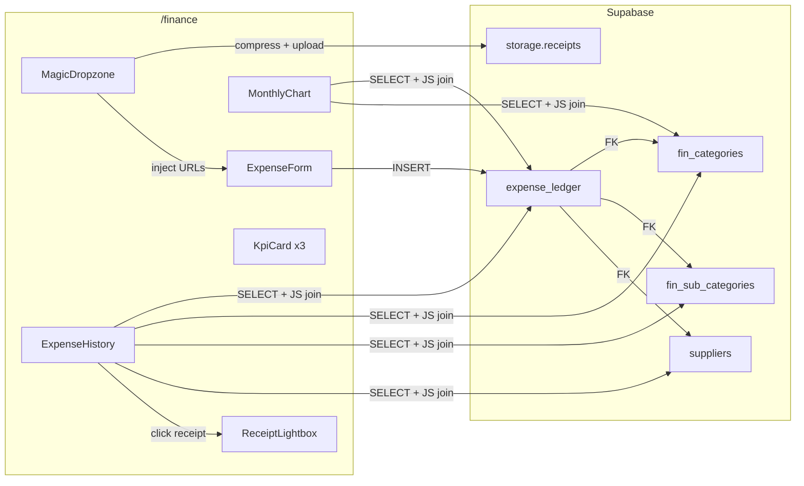
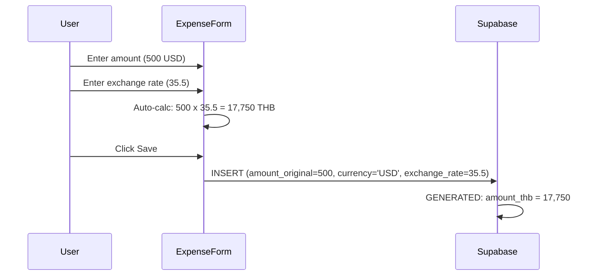
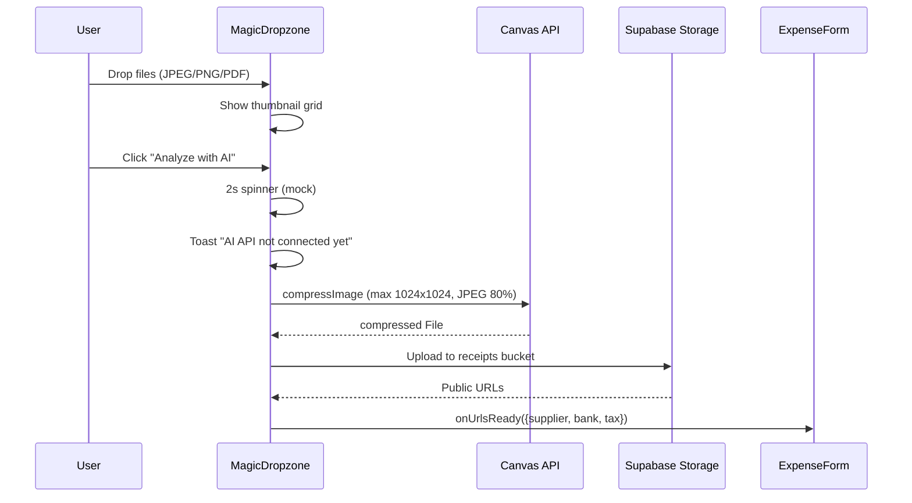

# Financial Ledger

> [!info] Phase 4.1 + 4.2
> Universal financial journal for OpEx/CapEx with multi-currency support, receipt storage, Magic Dropzone, and AI-ready receipt analysis.

## Overview

The Financial Ledger module provides a unified expense tracking system that supports multiple currencies, automatic THB conversion, and receipt document storage via Supabase Storage.

## Architecture

## Database Schema

### expense_ledger

| Column | Type | Notes |
|--------|------|-------|
| `id` | UUID PK | Auto-generated |
| `transaction_date` | DATE | Defaults to today |
| `flow_type` | TEXT | 'OpEx' or 'CapEx' |
| `category_code` | INTEGER FK | References `fin_categories.code` |
| `sub_category_code` | INTEGER FK | References `fin_sub_categories.sub_code` |
| `supplier_id` | UUID FK | References `suppliers.id` |
| `details` | TEXT | Free-text description |
| `amount_original` | NUMERIC | Amount in source currency |
| `currency` | TEXT | ISO code (THB, USD, EUR, etc.) |
| `exchange_rate` | NUMERIC | Conversion rate to THB |
| `amount_thb` | NUMERIC | **GENERATED**: `amount_original * exchange_rate` |
| `paid_by` | TEXT | Who paid |
| `payment_method` | TEXT | cash, transfer, card, other |
| `status` | TEXT | pending, paid, cancelled |
| `receipt_supplier_url` | TEXT | Supabase Storage URL |
| `receipt_bank_url` | TEXT | Supabase Storage URL |
| `tax_invoice_url` | TEXT | Supabase Storage URL |

> [!warning] Generated Column
> `amount_thb` is `GENERATED ALWAYS AS (amount_original * exchange_rate) STORED`. Never include it in INSERT or UPDATE statements.

### Storage Bucket: receipts

- **Bucket ID**: `receipts`
- **Public**: Yes (read access)
- **File size limit**: 5 MB
- **Allowed MIME types**: JPEG, PNG, WebP, PDF
- **Folder structure**: `supplier/`, `bank/`, `tax/`

## Multi-currency Flow

## Invoice Parser Integration

The [[Agent Skills & Capabilities|shishka-invoice-parser]] skill routes items to two targets:
- **Food items** (RAW/PF nomenclature match) --> `purchase_logs`
- **Non-food items** (services, utilities, equipment) --> `expense_ledger`

## Phase 4.2: Historical Sync & Smart UI

> [!success] Phase 4.2 LIVE
> 62 historical expenses imported, monolithic page refactored to components, Magic Dropzone with client-side compression.

### Migration 025: Historical Data Import

- **UNIQUE constraint** on `suppliers.name` for idempotent upserts
- **19 new suppliers** (construction, equipment, legal, IT, etc.)
- **62 expense rows** (Oct 2025 - Mar 2026): CapEx 46 rows (1.4M THB), OpEx 16 rows (683K THB)
- Multi-currency: THB, USD (5 rows, rates ~34.5-35.1), AED (1 row, rate 9.4184)
- All INSERTs are idempotent via `WHERE NOT EXISTS` guard on transaction ID

### Component Architecture

| Component | Lines | Purpose |
|---|---|---|
| `helpers.ts` | 20 | Shared formatTHB, constants |
| `KpiCard.tsx` | 42 | This Month / All-time / Transactions cards |
| `MonthlyChart.tsx` | 101 | Stacked BarChart by category |
| `ExpenseForm.tsx` | 270 | Multi-currency form + receiptUrls prop |
| `ExpenseHistory.tsx` | 145 | Table with lightbox triggers |
| `MagicDropzone.tsx` | 195 | Drag-and-drop + compression + mock AI |
| `ReceiptLightbox.tsx` | 60 | Modal image/PDF viewer |
| `FinanceManager.tsx` | 110 | Thin orchestrator (was 905 lines) |

### Magic Dropzone Flow

## Related

- [[Shishka OS Architecture]] -- System overview
- [[Procurement Module]] -- Supplier management and purchase logs
- [[Agent Skills & Capabilities]] -- Invoice parser skill
- [[STATE]] -- Migration 024-025 details
