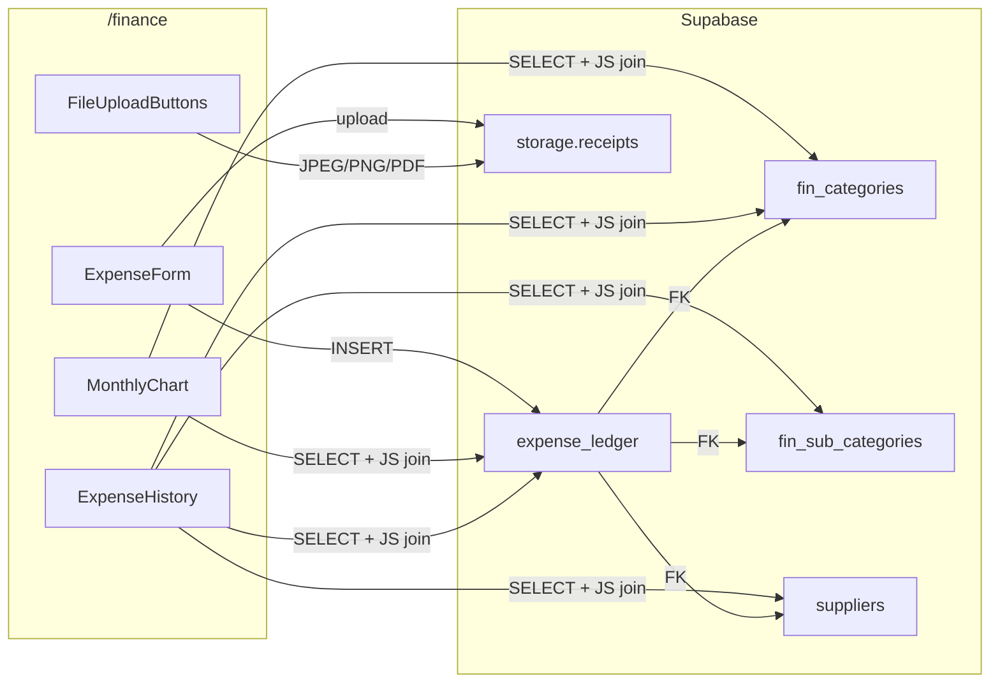
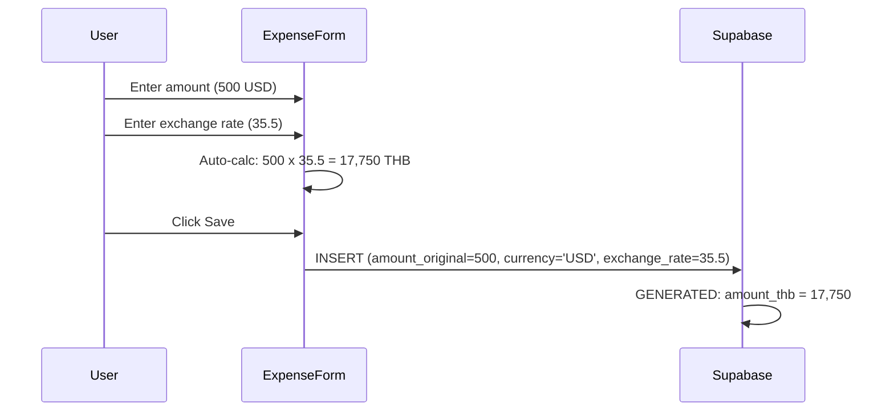

# Financial Ledger

> [!info] Phase 4.1
> Universal financial journal for OpEx/CapEx with multi-currency support and receipt storage.

## Overview

The Financial Ledger module provides a unified expense tracking system that supports multiple currencies, automatic THB conversion, and receipt document storage via Supabase Storage.

## Architecture

## Database Schema

### expense_ledger

| Column | Type | Notes |
|--------|------|-------|
| `id` | UUID PK | Auto-generated |
| `transaction_date` | DATE | Defaults to today |
| `flow_type` | TEXT | 'OpEx' or 'CapEx' |
| `category_code` | INTEGER FK | References `fin_categories.code` |
| `sub_category_code` | INTEGER FK | References `fin_sub_categories.sub_code` |
| `supplier_id` | UUID FK | References `suppliers.id` |
| `details` | TEXT | Free-text description |
| `amount_original` | NUMERIC | Amount in source currency |
| `currency` | TEXT | ISO code (THB, USD, EUR, etc.) |
| `exchange_rate` | NUMERIC | Conversion rate to THB |
| `amount_thb` | NUMERIC | **GENERATED**: `amount_original * exchange_rate` |
| `paid_by` | TEXT | Who paid |
| `payment_method` | TEXT | cash, transfer, card, other |
| `status` | TEXT | pending, paid, cancelled |
| `receipt_supplier_url` | TEXT | Supabase Storage URL |
| `receipt_bank_url` | TEXT | Supabase Storage URL |
| `tax_invoice_url` | TEXT | Supabase Storage URL |

> [!warning] Generated Column
> `amount_thb` is `GENERATED ALWAYS AS (amount_original * exchange_rate) STORED`. Never include it in INSERT or UPDATE statements.

### Storage Bucket: receipts

- **Bucket ID**: `receipts`
- **Public**: Yes (read access)
- **File size limit**: 5 MB
- **Allowed MIME types**: JPEG, PNG, WebP, PDF
- **Folder structure**: `supplier/`, `bank/`, `tax/`

## Multi-currency Flow

## Invoice Parser Integration

The [[Agent Skills & Capabilities|shishka-invoice-parser]] skill routes items to two targets:
- **Food items** (RAW/PF nomenclature match) --> `purchase_logs`
- **Non-food items** (services, utilities, equipment) --> `expense_ledger`

## Related

- [[Shishka OS Architecture]] -- System overview
- [[Procurement Module]] -- Supplier management and purchase logs
- [[Agent Skills & Capabilities]] -- Invoice parser skill
- [[STATE]] -- Migration 024 details
