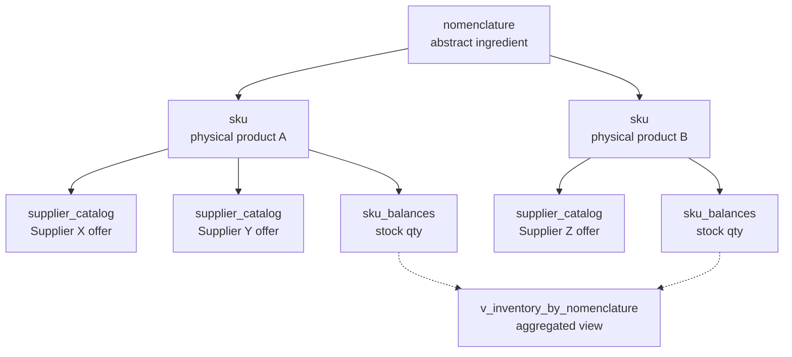

# Phase 10: SKU Layer — 3-Tier Product Architecture

> [!summary]
> Intermediate `sku` table between `nomenclature` and `supplier_catalog`. Resolves data duplication, enables barcode scanning, and unlocks brand analytics.

## Problem Statement

2-tier architecture (`nomenclature → supplier_catalog`) caused 3 issues:

1. **Data Duplication** — same physical product from 3 suppliers = brand, barcode, package info duplicated 3x
2. **Inventory Blindspot** — `inventory_balances` at nomenclature level, barcodes on `supplier_catalog` — scanner can't match
3. **Analytics Gap** — brand spend analysis required aggregation through supplier price lists

## Solution: 3-Tier Architecture

```
nomenclature (abstract ingredient: "Olive Oil", base_unit: L)
  └── sku (physical product: "Monini Extra Virgin 1L", SKU-0001, barcode: 800551...)
        └── supplier_catalog (supplier offer: "Makro, 500 THB/case of 12")
```



## Key Decisions

| Decision | Choice | Rationale |
|----------|--------|-----------|
| SKU code format | `SKU-0001` auto-generated | Readable internal codes for items without barcodes |
| UoM conversion | Stays on `supplier_catalog` | Each supplier sells same product in different packaging |
| Inventory level | `sku_balances` replaces `inventory_balances` | Enables barcode-level stock tracking |
| Aggregation | `v_inventory_by_nomenclature` view | Drop-in replacement for BOM/MRP/WAC queries |
| Waste deduction | FIFO by `last_received_at` | Oldest stock deducted first |

## Migrations

### 057: SKU Schema + Data Migration

- `sku` table — physical product with brand, barcode, package info
- `sku_balances` — SKU-level inventory (replaces `inventory_balances`)
- `v_inventory_by_nomenclature` — aggregation view
- `fn_generate_sku_code()` — auto-increment SKU-XXXX
- `fn_sku_set_code()` trigger — auto-assign on INSERT
- Data migration: `supplier_catalog` → `sku` (barcoded, non-barcoded, generic)
- Backfill `supplier_catalog.sku_id` and `purchase_logs.sku_id`
- Migrate `inventory_balances` → `sku_balances`

### 058: RPC Updates (SKU-aware)

- `fn_approve_receipt` v10 — SKU resolution chain: barcode → catalog → nomenclature → auto-create
- `fn_update_cost_on_purchase` v3 — reads `v_inventory_by_nomenclature`
- `fn_run_mrp` v2 — reads `v_inventory_by_nomenclature`
- `fn_predictive_procurement` v3 — reads `v_inventory_by_nomenclature`
- `DROP TABLE inventory_balances`

## Frontend Changes

| File | Change |
|------|--------|
| `types/receipt.ts` | + `sku_id`, `barcode` on LineItem & FoodItem |
| `useInventory.ts` | Major rewrite: `sku_balances` + `sku` join, dual output (byNomenclature + bySku) |
| `useSupplierMapping.ts` | MappingMatch + `skuId`, `barcode`, `brandName`, `productName`; embedded select via FK join |
| `useSpokeData.ts` | PurchaseLogRow + `sku_id`, `sku_product_name`, `sku_barcode`; 5th query for SKU data |
| `useWasteLog.ts` | FIFO sku_balances deduction (oldest `last_received_at` first) |

## Future Work (Stage 5)

- [ ] DROP deprecated columns from `supplier_catalog` (barcode, product_name, brand, package_*)
- [ ] ALTER `supplier_catalog.sku_id` SET NOT NULL
- [ ] DROP `nomenclature.brand_id`
- [ ] `SkuManager.tsx` — dedicated SKU management page
- [ ] `BarcodeScanner.tsx` — scanner component for stocktake

## Related

- [[Database Schema]] — Full ERD with sku entity
- [[Shishka OS Architecture]] — System overview
- [[Phase 7.1 DB Architecture Audit]] — WAC costing, supplier_catalog SSoT
- [[Phase 9 Tech Debt Cleanup]] — Ghost table removal, RPC rewrites
