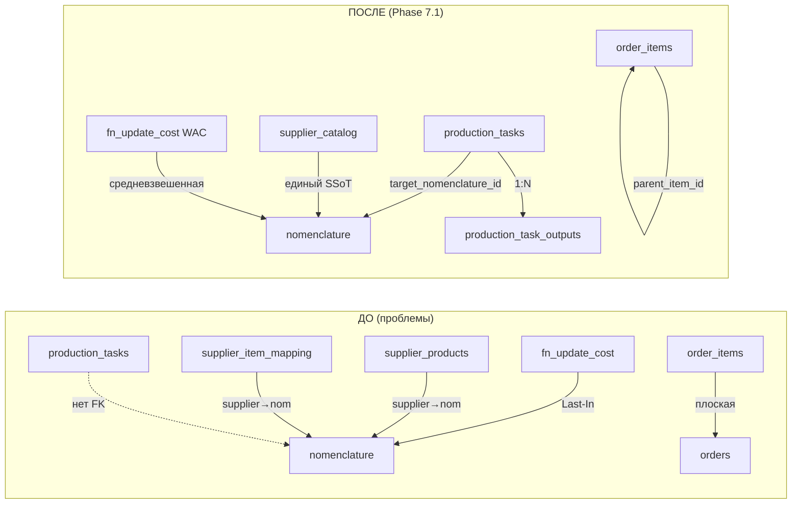

# Phase 7.1 — DB Architecture Audit

> [!abstract] Summary
> Глубокий аудит схемы БД выявил 5 критических архитектурных проблем + косметические замечания. Результат: 6 миграций (048–053), устраняющих нарушения SSoT, логические коллизии и уязвимости безопасности.

## Контекст

Аудит проведен при подготовке к масштабированию FMCG + гибридность ресторана. Проверены все 47 существующих миграций и [[Database Schema]].

## Выявленные проблемы и решения

### 1. Production Tasks — потерянный целевой продукт

> [!bug] Проблема
> `production_tasks` не имела FK на производимый продукт. KDS не мог фильтровать/группировать задания по типу ПФ. Variance analysis требовал разбора JSONB.

**Решение (миграция 048):**
- `ALTER production_tasks ADD target_nomenclature_id, target_quantity`
- `CREATE TABLE production_task_outputs` — мультивыход (основной продукт + побочные)
- Backfill: description → nomenclature.name для существующих заданий

### 2. Procurement SSoT — конфликт каталогов поставщиков

> [!bug] Проблема
> `supplier_item_mapping` (рецепт-маппинг) и `supplier_products` (верифицированный каталог) дублировали связь supplier→nomenclature. Риск рассинхрона конверсионной математики.

**Решение (миграция 049):**
- `CREATE TABLE supplier_catalog` — объединение всех колонок
- Data migration из обеих таблиц с MERGE-логикой
- DROP оригиналов → CREATE VIEWs для backward-compat
- `fn_approve_receipt` v9 — запрос к `supplier_catalog`

### 3. Finance COGS — Last-In → WAC

> [!bug] Проблема
> `fn_update_cost_on_purchase()` использовала Last-In: 1 кг по 500 THB переоценивал весь склад из 50 кг по 300 THB.

**Решение (миграция 050):**
- WAC = (current_qty × current_cost + new_qty × new_price) / (current_qty + new_qty)
- Использует `inventory_balances.quantity` + `nomenclature.cost_per_unit`
- Edge case: нет баланса → fallback на цену закупки

### 4. OMS — плоские order_items без модификаторов

> [!bug] Проблема
> Плоская таблица `order_items` не позволяла понять, к какому блюду относится топпинг в мульти-позиционном заказе. KDS сборочная станция не работала.

**Решение (миграция 051):**
- `ALTER order_items ADD parent_item_id UUID REFERENCES order_items(id)` — self-ref FK
- `ADD modifier_type TEXT` — topping, modifier, extra, removal, side

### 5. Security — публичный доступ к ERP данным

> [!danger] Проблема
> Admin panel использует anon key. `expense_ledger`, `nomenclature`, инвентарь — 100% читаемы из интернета.

**Решение (миграция 053 — подготовка):**
- `fn_is_authenticated()` — сейчас `true`, Phase 8 переключит на `auth.role()`
- `fn_current_user_id()` — сейчас `NULL`, Phase 8 → `auth.uid()`
- Документирован полный план миграции RLS policies (30+ таблиц)

### 6. Косметика (миграция 052)

- `expense_ledger.created_by UUID` — трекинг авторства
- `recipes_flow` и `daily_plan` помечены DEPRECATED (не дропнуты — используются RPCs)

## Миграции

| # | Файл | Что делает |
|---|------|-----------|
| 048 | `048_production_outputs.sql` | target_nomenclature_id + production_task_outputs |
| 049 | `049_supplier_catalog.sql` | SSoT merge SIM+SP → supplier_catalog + fn_approve_receipt v9 |
| 050 | `050_wac_costing.sql` | WAC trigger (заменяет Last-In) |
| 051 | `051_order_modifiers.sql` | parent_item_id + modifier_type на order_items |
| 052 | `052_accountability_cleanup.sql` | created_by + deprecation recipes_flow/daily_plan |
| 053 | `053_security_prep.sql` | fn_is_authenticated + fn_current_user_id + RLS план |

## Архитектурная диаграмма — до и после

## Принятые решения

| Вопрос | Решение | Обоснование |
|--------|---------|-------------|
| Себестоимость | WAC (не FIFO) | Проще, не требует партионного учета при списании |
| Мультивыход | production_task_outputs (1:N) | Побочные продукты (бульон, сыворотка) |
| Каталог | Merge в supplier_catalog + views | SSoT без дублирования, backward-compat |
| Ghost tables | DEPRECATED, не DROP | RPCs активно используют recipes_flow, daily_plan |
| Security | Phase 8 (отдельная фаза) | Требует Auth UI + полную перестройку RLS |

## Отложено на Phase 8

- [ ] Supabase Auth (email/password для менеджеров)
- [ ] Login UI (`LoginPage.tsx`)
- [ ] Миграция всех RLS policies на `authenticated`
- [ ] `fn_is_authenticated()` → `auth.role() = 'authenticated'`
- [ ] `fn_current_user_id()` → `auth.uid()`
- [ ] DROP `recipes_flow` и `daily_plan` после переписывания RPCs

## Related

- [[Database Schema]] — обновленная схема с 053 миграциями
- [[Shishka OS Architecture]] — общая архитектура системы
- [[Receipt Routing Architecture]] — Hub & Spoke (fn_approve_receipt)
- [[Phase 7.0 Product Categorization Architecture]] — предыдущая фаза
