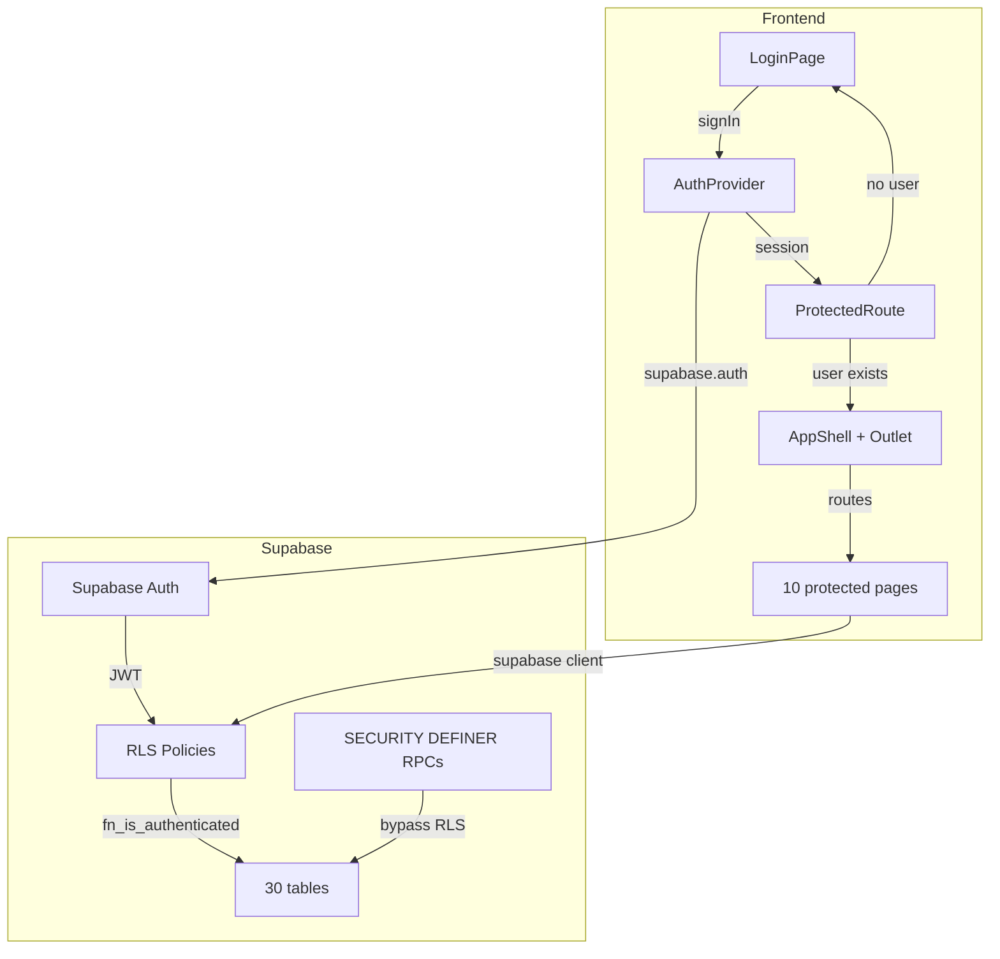

# Phase 8 — Supabase Auth + RLS Migration

> [!abstract] Summary
> Полная миграция с анонимного доступа на Supabase Auth (email/password). Фронтенд: AuthProvider + LoginPage + ProtectedRoute. БД: 30 таблиц переведены на `auth_full_access` RLS policy через `fn_is_authenticated()`. Автозаполнение `created_by` через триггер.

## Контекст

Phase 7.1 (миграция 053) заложила фундамент: `fn_is_authenticated()` возвращала `true`, `fn_current_user_id()` возвращала `NULL`. Admin panel использовал anon key с `persistSession: false` — все ERP данные были доступны без аутентификации.

## Архитектура Auth

## Frontend Changes

### Новые файлы
- `src/contexts/AuthContext.tsx` — AuthProvider + useAuth hook
- `src/pages/LoginPage.tsx` — email/password форма
- `src/components/ProtectedRoute.tsx` — auth guard с Outlet

### Изменённые файлы
- `src/lib/supabase.ts` — `persistSession: true`, `autoRefreshToken: true`, `detectSessionInUrl: true`
- `src/App.tsx` — layout routes: `/login` (public) → ProtectedRoute → AppShell → pages
- `src/layouts/AppShell.tsx` — `{children}` → `<Outlet />`, user email + кнопка "Выйти" в header, version `v0.6.0 · Phase 8`

## Миграции

| # | Файл | Что делает |
|---|------|-----------|
| 054 | `054_auth_rls.sql` | fn_is_authenticated() → auth.role(), fn_current_user_id() → auth.uid(). RLS enabled на 7 новых таблиц. DROP 70+ старых policies → CREATE 30 `auth_full_access` policies |
| 055 | `055_created_by_tracking.sql` | fn_set_created_by() trigger на expense_ledger — auto-fill created_by с auth.uid() |

## Принятые решения

| Вопрос | Решение | Обоснование |
|--------|---------|-------------|
| Auth provider | Email/password (Supabase built-in) | Простейший вариант, достаточный для internal ERP |
| RLS approach | Single `auth_full_access` FOR ALL на каждую таблицу | Единообразие, fn_is_authenticated() как единая точка контроля |
| SECURITY DEFINER RPCs | Не трогаем | fn_approve_receipt, fn_run_mrp и др. обходят RLS by design |
| created_by tracking | BEFORE INSERT trigger | auth.uid() доступен из JWT даже в DEFINER context |
| Session persistence | `persistSession: true` | Refresh страницы не разлогинивает |

## Ручные шаги (Supabase Dashboard)

> [!important] Выполнить ПЕРЕД применением миграции 054
> 1. Authentication → Providers → Email: Enable, disable "Confirm email"
> 2. Authentication → Users → "Add user" (boris@shishka.health)
> 3. Только после этого применять миграцию 054

## Related

- [[Phase 7.1 DB Architecture Audit]] — предыдущая фаза, заложила fn_is_authenticated/fn_current_user_id
- [[Database Schema]] — обновленная схема с 055 миграциями
- [[Shishka OS Architecture]] — общая архитектура системы
