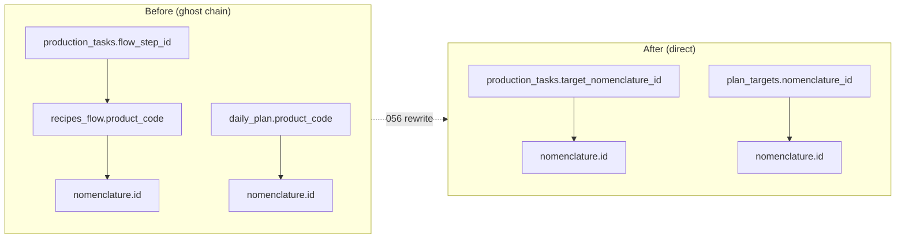

# Phase 9 — Tech Debt Cleanup

> [!summary] Ghost RPCs rewrite + deprecated drops + frontend UI alignment

## Migration 056: Ghost RPC Rewrite + Drops

### RPCs Rewritten

| RPC | Old Path | New Path |
|---|---|---|
| `fn_start_production_task` | flow_step_id → recipes_flow → product_code → nomenclature | target_nomenclature_id → nomenclature |
| `fn_create_batches_from_task` | flow_step_id → recipes_flow → product_code → nomenclature | target_nomenclature_id → nomenclature |
| `fn_predictive_procurement` | daily_plan (single product) → BOM walk | plan_targets (N products) → BOM walk per target → deduplicated |

### Dropped Objects

| Object | Type | Reason |
|---|---|---|
| `recipes_flow` | TABLE | Ghost dependency removed by RPC rewrite |
| `daily_plan` | TABLE | Replaced by production_plans + plan_targets |
| `flow_step_id` | COLUMN on production_tasks | Replaced by target_nomenclature_id (048) |
| `supplier_item_mapping` | VIEW | Frontend migrated to supplier_catalog |
| `supplier_products` | VIEW | Frontend migrated to supplier_catalog |

## Frontend Changes

### KDS — Target Product Display
- `useCookTasks.ts` / `useGanttTasks.ts`: Supabase embedded select `nomenclature!target_nomenclature_id(name, product_code)`
- `TaskExecutionCard.tsx`: Shows product name + product_code + target_quantity
- `GanttTaskBar.tsx`: Bar label = product name, tooltip includes target_quantity

### Orders — Modifier Tree UI
- `OrderDetailsModal.tsx`: Groups items by `parent_item_id`, renders modifiers indented with type badges
- Badge colors: topping=blue, extra=green, removal=red, side=amber, modifier=slate

### Supplier Mapping → supplier_catalog
- `useSupplierMapping.ts`: All `.from('supplier_item_mapping')` → `.from('supplier_catalog')` (7 occurrences)

### Predictive Procurement → production_plans
- `PredictivePO.tsx`: Fetches `production_plans` instead of `daily_plan`
- `usePredictivePO.ts`: RPC param `p_plan_id` → `p_production_plan_id`, result = array of items

### recharts Lazy Loading
- `MonthlyChart` (FinanceManager) and `CapExMiniChart` (ControlCenter) wrapped in `React.lazy()` + `Suspense`

## Related

- [[Database Schema]] — Updated for 056 drops
- [[Phase 8 Supabase Auth]] — Auth + RLS foundation
- [[Shishka OS Architecture]] — System overview
