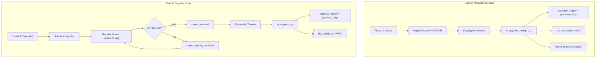
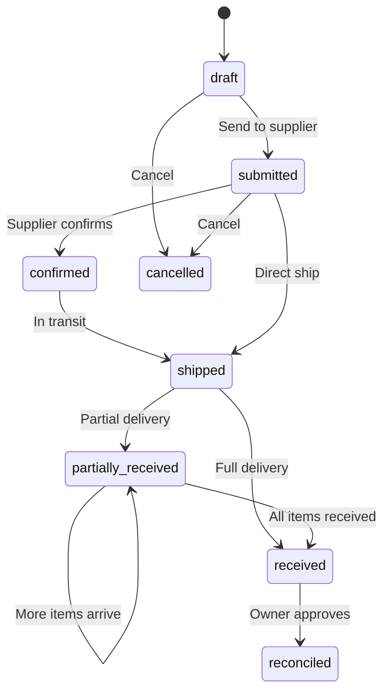
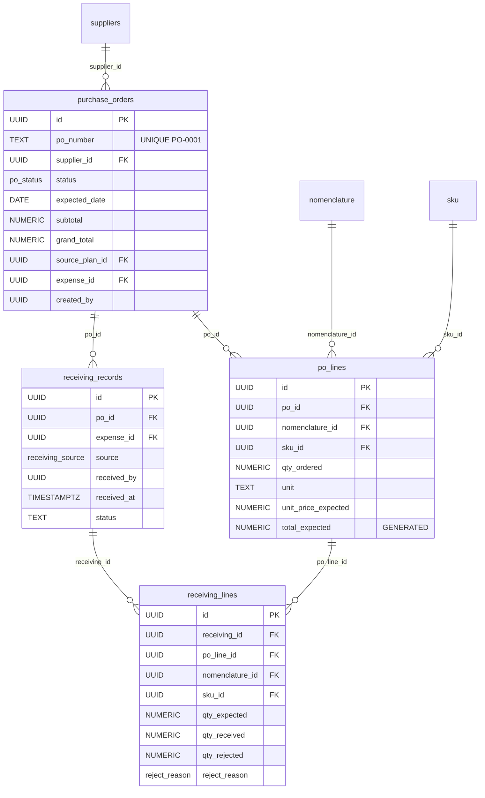

# Procurement & Receiving Architecture

> [!info] Phase 11-16
> Procurement & Receiving module covering two paths: receipt-based (existing) and PO-based (new). Designed for minimal cognitive load on kitchen staff.

## Two Procurement Paths

## User Roles

| Role | Person | Access |
|------|--------|--------|
| **Admin** | Operations | Creates POs, communicates with suppliers, physical receiving, inventory counts |
| **Cook** | Kitchen | Substitutes admin on receiving (/receive). Simplest UI, **NO financial data** |
| **Controller** | Owner (Lesia) | Financial reconciliation only. Only role that can Approve -> money + inventory |

## PO Status Lifecycle

## Database Schema

### New Tables

### New ENUMs

| Enum | Values |
|------|--------|
| `po_status` | draft, submitted, confirmed, shipped, partially_received, received, reconciled, cancelled |
| `receiving_source` | purchase_order, receipt |
| `reject_reason` | short_delivery, damaged, wrong_item, quality_reject, expired |

## Key RPCs

| Function | Role | Purpose |
|----------|------|---------|
| `fn_create_purchase_order(JSONB)` | Admin | Creates PO + lines, auto-populates prices from supplier_catalog |
| `fn_receive_goods(JSONB)` | Admin/Cook | Physical receiving. NO inventory update. Sets partially_received or received |
| `fn_approve_po(JSONB)` | Controller | Financial reconciliation. Creates expense_ledger + purchase_logs + sku_balances + WAC |
| `fn_pending_deliveries()` | Admin/Cook | Returns pending POs for /receive screen. NO prices |
| `fn_approve_receipt v11` | Controller | Enhanced: now also creates receiving_records for audit trail |

## Receiving UX Design

> [!important] Zero Cognitive Load
> The /receive screen is designed for "dirty hands, no time". No prices, no typing, maximum touch targets.

- **Barcode scanner**: one scan = +1 qty_received (auto-OK when qty matches)
- **Two buttons per item**: OK (full qty) or Issue (stepper + reason)
- **Accept All Remaining**: one tap for unchecked items
- **sessionStorage**: progress persists through page reloads

## Integration Points

- [[Database Schema]] -- All tables documented here
- [[Receipt Routing Architecture]] -- Path A receipt flow
- [[Shishka OS Architecture]] -- System overview
- [[Financial Ledger]] -- expense_ledger hub + spokes
- [[Phase 10 SKU Layer]] -- SKU resolution chain reused by fn_approve_po

## Implementation Phases

| Phase | Priority | Scope |
|-------|----------|-------|
| 11: DB Schema | P0 | ENUMs + 4 tables + links + migrations 060-063 |
| 12: RPCs | P0 | 5 RPCs + fn_approve_receipt v11 (migrations 064-065) |
| 13: Receiving Station | P1 | Mobile-first /receive page for kitchen |
| 14: PO Management | P2 | Create/edit/list POs on /procurement |
| 15: Reconciliation | P2 | Visual diff + approve on /procurement |
| 16: MRP Integration | P3 | MRP shortages -> auto-create PO |
