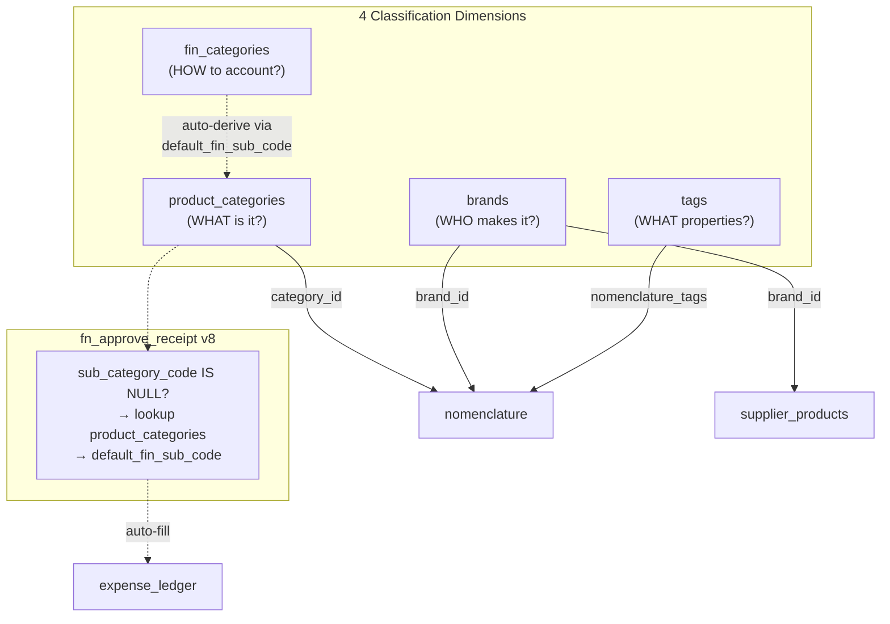
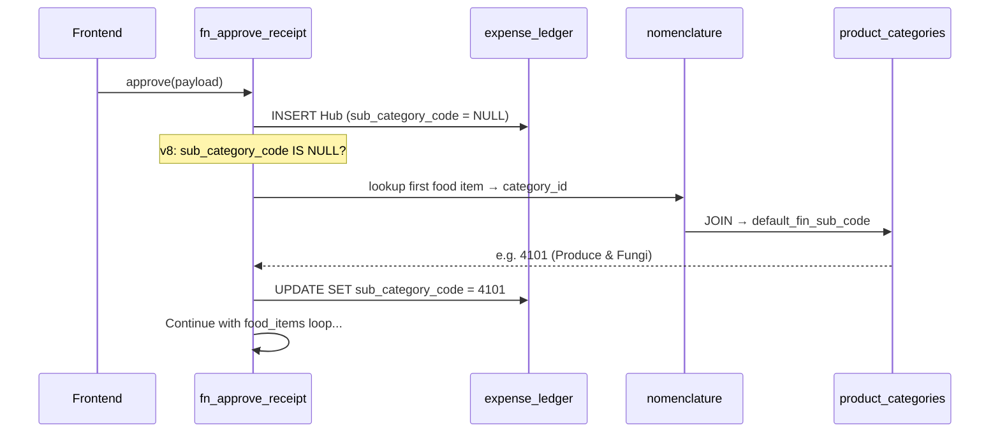

# Product Categorization Architecture

> [!info] Phase 7.0 — FMCG + Restaurant Hybrid Categorization System
> Migrations 045–047. Deployed 2026-03-13. Independent from [[Financial Ledger]] (fin_categories) — bridges via `default_fin_sub_code`.

## Design Principles

1. **4 Independent Dimensions** — product hierarchy, brands, tags, financial codes operate independently
2. **GS1 GPC Inspired** — 3-level self-referencing hierarchy (Segment → Family → Class)
3. **ECR Category Management** — Russian FMCG approach (Магнит/Лента: Сектор → Группа → Категория)
4. **Restaurant365 Pattern** — item categories separate from menu categories
5. **Auto-derive Bridge** — `product_categories.default_fin_sub_code` → `fin_sub_categories.sub_code`

## Architecture Overview

## Category Hierarchy (3 Levels)

```mermaid
graph TD
    F["F — Food<br/>อาหาร"]
    NF["NF — Non-Food<br/>สินค้าไม่ใช่อาหาร"]
    KP["KP — Kitchen Production<br/>ผลิตภัณฑ์ครัว"]

    F --> F_PRD["F-PRD Produce"]
    F --> F_PRO["F-PRO Proteins"]
    F --> F_GRN["F-GRN Grains"]
    F --> F_DAI["F-DAI Dairy & Fats"]
    F --> F_NTS["F-NTS Nuts & Seeds"]
    F --> F_SPC["F-SPC Spices & Pantry"]
    F --> F_BKR["F-BKR Bakery"]
    F --> F_FRM["F-FRM Fermented"]
    F --> F_SAU["F-SAU Sauces"]
    F --> F_BEV["F-BEV Beverages"]
    F --> F_SNK["F-SNK Snacks"]
    F --> F_SUP["F-SUP Superfoods"]

    NF --> NF_CLN["NF-CLN Cleaning"]
    NF --> NF_PKG["NF-PKG Packaging"]
    NF --> NF_DSP["NF-DSP Disposables"]
    NF --> NF_OFC["NF-OFC Office"]

    KP --> KP_BSE["KP-BSE Bases & Stocks"]
    KP --> KP_PRP["KP-PRP Prep Components"]
    KP --> KP_FIN["KP-FIN Finished Dishes"]
    KP --> KP_DRK["KP-DRK Drinks"]
    KP --> KP_TOP["KP-TOP Toppings"]

    F_PRD --> VEG["F-PRD-VEG Vegetables"]
    F_PRD --> FRU["F-PRD-FRU Fruit"]
    F_PRD --> HRB["F-PRD-HRB Herbs"]
    F_PRD --> MSH["F-PRD-MSH Mushrooms"]
    F_PRD --> FRZ["F-PRD-FRZ Frozen"]
```

## Tables

### product_categories

Self-referencing 3-level hierarchy. ==75 nodes total== (3 L1 + 16 L2 + 56 L3).

| Column | Type | Notes |
|---|---|---|
| `id` | UUID PK | Auto-generated |
| `code` | TEXT UNIQUE | Hierarchical: `F`, `F-PRD`, `F-PRD-VEG` |
| `name` | TEXT | English name |
| `name_th` | TEXT | Thai name |
| `parent_id` | UUID FK → self | NULL for L1 sectors |
| `level` | SMALLINT (1-3) | Enforced CHECK constraint |
| `sort_order` | INTEGER | Display order within parent |
| `default_fin_sub_code` | INTEGER FK → fin_sub_categories | Auto-derive bridge to financial system |
| `is_active` | BOOLEAN | Soft-delete |

### brands

Normalized brand directory. ==10 brands== seeded from `supplier_products.brand`.

| Column | Type | Notes |
|---|---|---|
| `id` | UUID PK | Auto-generated |
| `name` | TEXT UNIQUE | Brand name (MAKRO, KNORR, etc.) |
| `name_th` | TEXT | Thai brand name |
| `country` | TEXT | Country code (TH, AU, NZ) |
| `is_active` | BOOLEAN | Soft-delete |

### tags

Cross-cutting attributes. ==~37 tags== across 7 groups.

| Group | Count | Examples |
|---|---|---|
| `dietary` | 8 | vegan, vegetarian, keto, paleo, whole30, halal, gluten-free, dairy-free |
| `allergen` | 8 | gluten, dairy, nuts, soy, eggs, fish, shellfish, sesame |
| `storage` | 4 | frozen, chilled, ambient, dry |
| `quality` | 3 | organic, non-gmo, local-th |
| `functional` | 6 | high-protein, low-carb, probiotic, antioxidant, anti-inflammatory, adaptogenic |
| `technique` | 6 | fermented, raw, roasted, steamed, smoked, sous-vide |
| `cuisine` | 7 | thai, japanese, mediterranean, indian, georgian, arabic, nordic |

### nomenclature_tags

Junction table for many-to-many: `nomenclature` ↔ `tags`. Composite PK `(nomenclature_id, tag_id)`.

## Auto-Derive Flow (fn_approve_receipt v8)

## Financial Bridge Mapping

> [!tip] Product → Financial Auto-Derive
> L3 categories map to `fin_sub_categories` via `default_fin_sub_code`. This eliminates manual financial classification on receipt approval.

| L1 | L2 Code | L3 Example | → fin_sub_code | fin_sub_name |
|---|---|---|---|---|
| F | F-PRD | F-PRD-VEG | 4101 | Produce & Fungi |
| F | F-PRO | F-PRO-PLT | 4102 | Proteins (Meat/Fish) |
| F | F-GRN | F-GRN-RIC | 4103 | Grains & Superfoods |
| F | F-DAI | F-DAI-MLK | 4104 | Dairy & Fats |
| F | F-NTS | F-NTS-NUT | 4105 | Nuts & Seeds |
| F | F-SPC | F-SPC-DRY | 4106 | Spices & Pantry |
| F | F-BKR | F-BKR-FLR | 4107 | Bakery & Flour |
| F | F-FRM | F-FRM-FRM | 4108 | Fermented & Preserved |
| F | F-SNK | F-SNK-BAR | 4109 | Snacks |
| F | F-BEV | F-BEV-TEA | 4110 | Beverages |
| F | F-SAU | F-SAU-CHI | 4111 | Sauces & Condiments |
| NF | NF-PKG | NF-PKG-CNT | 4201 | Bowls & Containers |
| NF | NF-PKG | NF-PKG-CTL | 4202 | Cutlery & Napkins |
| KP | -- | -- | NULL | N/A (internal production) |

## Migration History

| Migration | Content |
|---|---|
| 044 | Nomenclature dedup (safe FK-aware DELETEs), salt taxonomy (3 types), fix null base_units |
| 045 | CREATE product_categories + brands + tags + nomenclature_tags. SEED 75 categories, 10 brands, ~37 tags |
| 046 | ALTER nomenclature + supplier_products (add category_id, brand_id FKs). Backfill all ~78 items |
| 047 | fn_approve_receipt v8 — auto-derive sub_category_code from product_categories.default_fin_sub_code |

## Future: Frontend Components

> [!todo] Planned for next phase
> - `CategoryPicker.tsx` — 3-level cascading dropdown (L1 → L2 → L3)
> - `TagPillBar.tsx` — multi-select pill badges with color coding
> - `BrandSelect.tsx` — searchable brand combobox with auto-create
> - `RecipeBuilder.tsx` — category integration for BOM ingredient selection

## Related

- [[Database Schema]] — Full ER diagram and table reference
- [[Shishka OS Architecture]] — System overview
- [[Financial Ledger]] — fin_categories / fin_sub_categories detail
- [[Receipt Routing Architecture]] — Hub & Spoke pattern (fn_approve_receipt)
