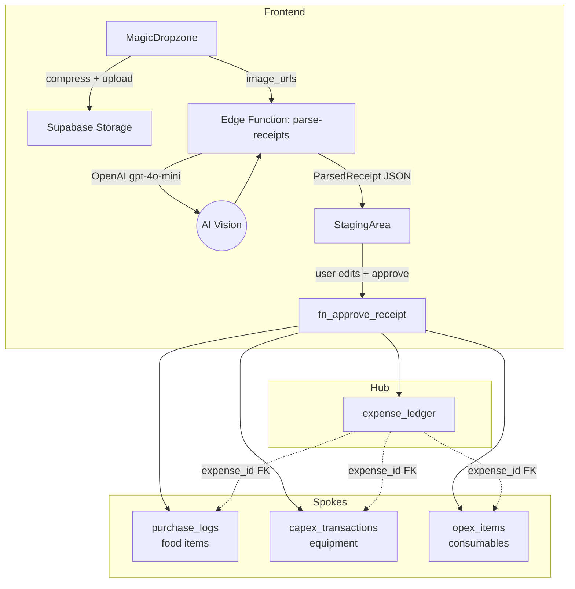

# Receipt Routing Architecture

> [!info] Phase 4.4
> AI-powered receipt parsing with Hub & Spoke line-item routing. Replaces the mock AI button in MagicDropzone with a real OpenAI gpt-4o-mini vision call.

## Hub & Spoke Model

## Data Flow

1. User drops receipt images onto **MagicDropzone**
2. Images compressed (Canvas API, max 1024px, JPEG 80%) and uploaded to `receipts` Storage bucket
3. Public URLs sent to **parse-receipts** Edge Function
4. Edge Function calls OpenAI gpt-4o-mini with vision — classifies line items as food / capex / opex
5. Structured JSON returned to **StagingArea** component
6. User reviews, edits items, maps food items to nomenclature, selects supplier from dropdown
7. "Approve & Save" calls **fn_approve_receipt** RPC
8. RPC atomically inserts: expense_ledger (Hub) + purchase_logs + capex_transactions + opex_items (Spokes)

## Classification Rules

| Category | Target Table | Examples |
|---|---|---|
| Food items | `purchase_logs` | Produce, proteins, grains, dairy, spices, oils |
| CapEx items | `capex_transactions` | Equipment, machinery, furniture, IT hardware |
| OpEx items | `opex_items` | Cleaning supplies, packaging, disposables, services |

## Key Design Decisions

- **Supplier dropdown** (not free text) to prevent AI typo duplicates
- **Exchange rate** exposed when currency != THB
- **fn_approve_receipt** uses `SECURITY DEFINER` and `EXCEPTION WHEN OTHERS` for atomic rollback
- **purchase_logs.nomenclature_id** is NOT NULL — user must map every food item before approval
- **capex_transactions.amount_thb** is direct NUMERIC (not GENERATED) — safe for direct INSERT

## Related

- [[Database Schema]] -- Full schema with ERD
- [[Financial Ledger]] -- Finance module details
- [[STATE]] -- Migration deployment history
