# Shishka OS Architecture

> [!info] Single Source of Truth
> Supabase (PostgreSQL 17.6) is the ONLY source of truth. The frontend is a mirror.

## System Overview

Shishka OS is a unified ERP/KDS system for Shishka Healthy Kitchen, built on **React + Vite + Tailwind v4 + Supabase**.

```mermaid
graph TD
    subgraph Frontend ["Frontend (React + Vite)"]
        CC[Control Center /]
        BOM[BOM Hub /bom]
        KDS[KDS Board /kds]
        COOK[Cook Station /cook]
        WASTE[Waste Tracker /waste]
        LOG[Logistics /logistics]
        PROC[Procurement /procurement]
        ORD[Orders /orders]
        MRP[Master Planner /planner]
        FIN[Finance /finance]
    end

    subgraph Backend ["Supabase (PostgreSQL 17.6)"]
        NOM[nomenclature]
        BS[bom_structures]
        PT[production_tasks]
        EQ[equipment]
        INV[inventory_batches + balances]
        WL[waste_logs]
        SUP[suppliers + purchase_logs]
        ORDERS[orders + order_items]
        PLANS[production_plans + plan_targets]
        EXP[expense_ledger + receipts]
    end

    CC --> PT & EQ & NOM
    BOM --> NOM & BS
    KDS --> PT & EQ
    COOK --> PT & INV
    WASTE --> WL & INV & NOM
    LOG --> INV
    PROC --> SUP & NOM
    ORD --> ORDERS & NOM
    MRP --> PLANS & BS & INV & NOM
    FIN --> EXP & SUP
```

## Lego Architecture (BOM)

The core data model follows a 4-tier Bill of Materials:

| Tier | Prefix | Example | Role |
|------|--------|---------|------|
| RAW | `RAW-` | RAW-PUMPKIN | Raw ingredients from suppliers |
| PF | `PF-` | PF-PUMPKIN_COCONUT_BASE | Semi-finished products (prep) |
| MOD | `MOD-` | MOD-ANCIENT_CRUNCH | Toppings and modifiers |
| SALE | `SALE-` | SALE-PUMPKIN_SOUP | Final dishes sold to customers |

## Development Phases

| Phase | Module | Status | Notes |
|-------|--------|--------|-------|
| 1.0 | [[Control Center]] + [[BOM Hub]] | ✅ LIVE | CEO Dashboard, KPI widgets |
| 1.5 | [[Storefront & Pricing]] | ✅ LIVE | Pricing engine, KBZHU, slugs |
| 2.0 | [[Kitchen KDS]] + [[Cook Station]] | ✅ LIVE | Gantt scheduling, cook execution |
| 3.0 | [[Waste & Inventory]] | ✅ LIVE | Stocktake, waste logging, predictive PO |
| 3.5 | [[Batch Tracking & Logistics]] | ✅ LIVE | Barcodes, locations, transfers |
| 3.6 | [[BOM Hub Editor]] | ✅ LIVE | Full CRUD, cost validation, DB sync |
| 4.0 | [[Procurement Module]] | ✅ LIVE | Supplier CRUD, purchase logs, auto-cost |
| 5.1 | [[Orders Pipeline]] | ✅ LIVE | Kanban, Realtime, BOM explosion |
| 5.2 | [[MRP Engine]] | ✅ LIVE | Scenario planning, inventory-aware |
| 5.3 | [[Knowledge Base Refactoring]] | ✅ LIVE | Obsidian Skills, vault cleanup |
| 5.4 | [[Agent Skills & Capabilities]] | ✅ LIVE | PDF, XLSX, skill-creator, invoice parser |
| 4.1 | [[Financial Ledger]] | ✅ LIVE | Expense ledger, multi-currency, receipt storage |
| 4.2 | [[Financial Ledger]] | ✅ LIVE | Historical sync (62 rows), Magic Dropzone, Receipt Lightbox, component extraction |
| 6.8 | [[Database Schema]] | ✅ LIVE | Product Catalog Overhaul, supplier_products, nomenclature dedup |
| 7.0 | [[Product Categorization Architecture]] | ✅ LIVE | FMCG+Restaurant hybrid: 3-level product_categories, brands, tags, auto-derive financial codes |

## Key Database Functions (RPCs)

| Function | Purpose |
|----------|---------|
| `fn_start_production_task` | Start cook task, freeze BOM snapshot |
| `fn_create_batches_from_task` | Create inventory batches from completed task |
| `fn_open_batch` / `fn_transfer_batch` | Batch lifecycle management |
| `fn_predictive_procurement` | Recursive BOM walk for shortage detection |
| `fn_process_new_order` | Order BOM explosion into production tasks |
| `fn_run_mrp` | 2-level MRP engine with inventory deduction |
| `fn_approve_plan` | Convert MRP results into kitchen tasks |
| `fn_approve_receipt` | Hub+Spoke receipt approval (v8: auto-derive sub_category from product_categories) |

## Migrations Index

See [[STATE]] for full migration details (001-047).

## Related

- [[Database Schema]] — Full erDiagram and tables index
- [[Product Categorization Architecture]] — FMCG+Restaurant hybrid category system (Phase 7.0)
- [[STATE]] — Current deployment state
- [[HANDOVER]] — Agent handover reports
- [[Agent Skills & Capabilities]] — Installed skills registry
