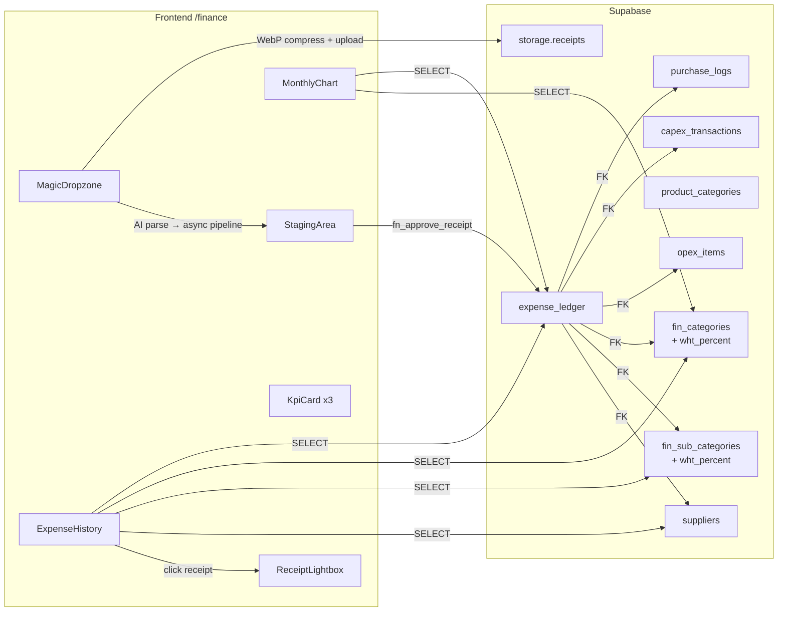
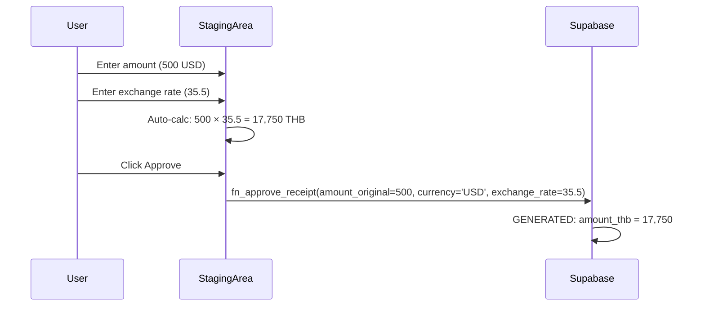

# Financial Ledger

> [!info] Phases 4.1 → 4.2 → 6.x
> Universal financial journal for OpEx/CapEx with multi-currency support, receipt storage, AI-powered parsing via [[Receipt Routing Architecture|Receipt Pipeline]], and Hub & Spoke routing to specialized tables.

## Overview

The Financial Ledger module provides a unified expense tracking system: multi-currency, automatic THB conversion, AI receipt OCR, auto-mapping engine, and receipt document storage via Supabase Storage.

## Architecture



## Two Category Systems

> [!warning] Critical Distinction
> The system has **two independent category hierarchies**. Mixing them causes wrong dropdowns.

| System | Table | Purpose | Example |
|--------|-------|---------|---------|
| **Financial categories** | `fin_categories` + `fin_sub_categories` | P&L accounting, WHT tax rates | 2300 Maintenance → 2301 AC Service (3% WHT) |
| **Product categories** | `product_categories` (3 levels) | Item classification | NF-CLN Cleaning → NF-CLN-DSH Dishwashing |

- **expense_ledger** uses `fin_categories` (category_code, sub_category_code)
- **Food items** in StagingArea show `product_categories` derived from nomenclature mapping
- **OpEx items** in StagingArea use `product_categories` dropdowns (Cat L2 + Sub L3)

## WHT (Withholding Tax)

`wht_percent NUMERIC DEFAULT 0` on both `fin_categories` and `fin_sub_categories` (Migration 068).

| Category | WHT % | Notes |
|----------|-------|-------|
| Rental (2100) | 5% | Requires P.N.D. 53 |
| Construction (1100) | 3% | |
| Maintenance (2300) | 3% | Services only; product purchases 0% |
| IT Software (1400) | 3% | |
| Marketing (2400) | 2% | |
| Delivery (2500) | 1% | Platform commission |
| Food / Packaging (4100-4200) | 0% | Product purchases |
| Utilities (2200) | 0% | Direct to PEA/PWA |
| Equipment (1200) | 0% | Asset purchase |

## Database Schema

### expense_ledger

| Column | Type | Notes |
|--------|------|-------|
| `id` | UUID PK | Auto-generated |
| `transaction_date` | DATE | From source document (RULE-TXN-DATE-INTEGRITY) |
| `flow_type` | TEXT | 'OpEx' or 'CapEx' |
| `category_code` | INTEGER FK | `fin_categories.code` |
| `sub_category_code` | INTEGER FK | `fin_sub_categories.sub_code` |
| `supplier_id` | UUID FK | `suppliers.id` |
| `details` | TEXT | Free-text description |
| `amount_original` | NUMERIC | Amount in source currency |
| `currency` | TEXT | ISO code (THB, USD, EUR, etc.) |
| `exchange_rate` | NUMERIC | Conversion rate to THB |
| `amount_thb` | NUMERIC | **GENERATED**: `amount_original * exchange_rate` |
| `paid_by` | TEXT | Who paid |
| `payment_method` | TEXT | cash, transfer, card, other |
| `status` | TEXT | pending, paid, cancelled |
| `receipt_supplier_url` | TEXT | Supabase Storage URL |
| `receipt_bank_url` | TEXT | Supabase Storage URL |
| `tax_invoice_url` | TEXT | Supabase Storage URL |
| `comments` | TEXT | Free-text notes |
| `has_tax_invoice` | BOOLEAN | Tax invoice attached |
| `created_by` | UUID | Auto-filled via trigger |

> [!warning] Generated Column
> `amount_thb` is `GENERATED ALWAYS AS (amount_original * exchange_rate) STORED`. Never include it in INSERT or UPDATE statements.

### Hub & Spoke Tables

| Spoke | Table | FK | Purpose |
|-------|-------|-----|---------|
| Food | `purchase_logs` | `expense_id → expense_ledger.id` | RAW ingredient purchases |
| CapEx | `capex_transactions` | `expense_id → expense_ledger.id` | Equipment, construction |
| OpEx | `opex_items` | `expense_id → expense_ledger.id` | Cleaning, packaging, services |

### Storage Bucket: receipts

- **Bucket ID**: `receipts`
- **Public**: Yes (read access)
- **Allowed MIME types**: JPEG, PNG, WebP, PDF
- **Folder structure**: `supplier/`, `bank/`, `tax/`

## Multi-currency Flow



Supported currencies: THB, USD, EUR, RUB, GBP, CNY, JPY, AED.

## StagingArea Layout

### Food Items Table
```
│ ✓ │ # │ SKU │ Item │ Mapping │ Cat │ Sub │ Pkg │ Qty │ Unit │ Price │ Total │ × │
```
- **Mapping**: SearchableNomenclatureSelect (combobox with search)
- **Cat / Sub**: Auto-derived from nomenclature → product_categories
- **Pkg**: Brand + weight side-by-side, Σ net weight below

### OpEx Table
```
│ ✓ │ # │ SKU │ Description │ — │ Cat │ Sub │ — │ Qty │ Unit │ Price │ Total │ — │
```
- **Cat / Sub**: Manual dropdowns from product_categories (L2 + L3)
- Empty columns are spacers for alignment with Food Items table

### UI Features
- **Sticky headers** via `max-h-[60vh] overflow-auto` + `sticky top-0 z-10`
- **Sticky total bar** with full precision amounts (formatTHBFull)
- **ReconciliationPanel**: editable footer (discount, VAT, delivery), green checkmark when balanced

## Component Architecture

| Component | Purpose |
|-----------|---------|
| `FinanceManager.tsx` | Page orchestrator — job tracking, Realtime, sanitization |
| `MagicDropzone.tsx` | Upload + WebP compress + model select + fire-and-forget |
| `StagingArea.tsx` | Full-width editor — mapping, review, approve |
| `SearchableNomenclatureSelect.tsx` | Combobox for nomenclature mapping (500+ items) |
| `helpers.ts` | formatTHB, formatTHBFull, parseWeight, formatNetWeight, constants |
| `ExpenseHistory.tsx` | Historical table with lightbox |
| `MonthlyChart.tsx` | Stacked BarChart by category |
| `KpiCard.tsx` | This Month / All-time / Transactions |
| `ReconciliationPanel.tsx` | Footer math: subtotal + discount + VAT + delivery = grand_total |

## Related

- [[Receipt Routing Architecture]] — AI OCR pipeline details
- [[Database Schema]] — Full schema with ERD
- [[Procurement & Receiving Architecture]] — PO-based procurement flow
- [[Product Categorization Architecture]] — product_categories vs fin_categories
